# [10강] RNN, LSTM

* Recurrent Networks offer a lot of flexibility

  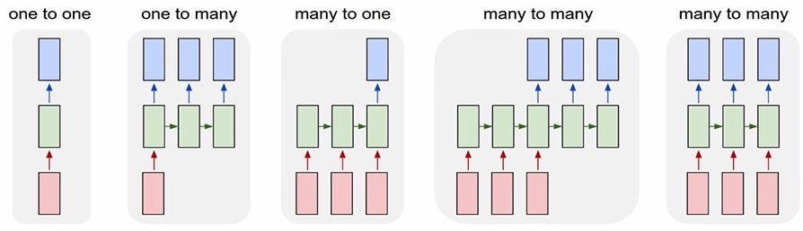

  * one to one = Vanilla Neural Networks

  * Input layer : 이미지
    * Hidden layer
    * Output layer : class의 score

  * one to many = Image Captioning : image → sequence of words 
    이미지를 묘사하는 단어들의 sequence

  * many to one = Sentiment Classification : sequence of words → sentiment 
    감정을 분류(감정이 positive or negative)

  * many to many
    * Machine Translation = seq of words → seq of words 번역
    * Video classification on frame level 예측이 현재시점에서만 되면 안됌
      * 모든 각각의 타임스탭에서의 예측 = 현재의 프레임 + 지나간 프레임들의 함수

### RNN (Recurrent Neural Networks)

> time step에서의 벡터를 예측하기를 원함

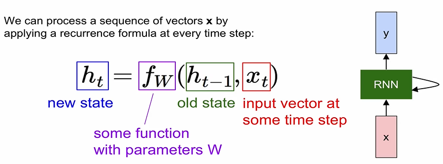

* recurrence function
  * notice : 매 time step마다 동일한 function, parameters가 사용되어야 함

* (Vanilla) Recurrent Neural Network
  * The state consists of a single hidden vector `h`
  *  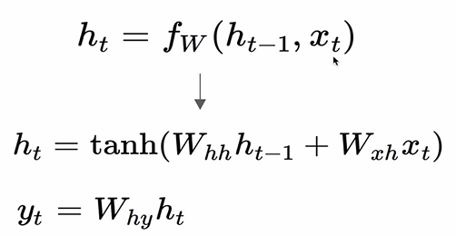
  * Character-level language model example : 다음에 올 알파벳 예측
    * Vocabulary : [h, e, l, o]
    * Example training sequence : "hello"
    *  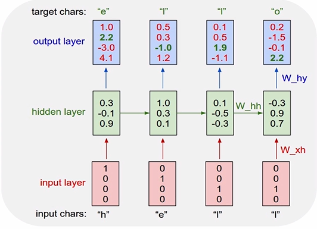

### LSTM (Long Short Term Memory)

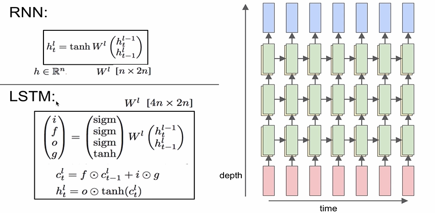

* RNN : hidden state vector
* LSTM : hidden state vector + cell state vector 같이 존재

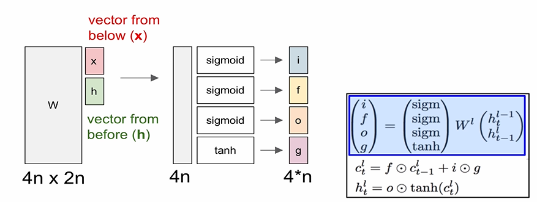

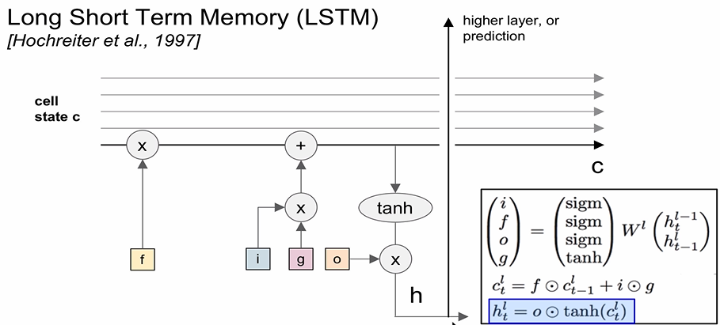

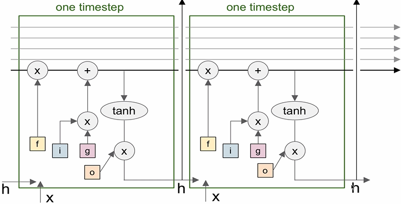

* RNN 보다 LSTM을 더 사용

  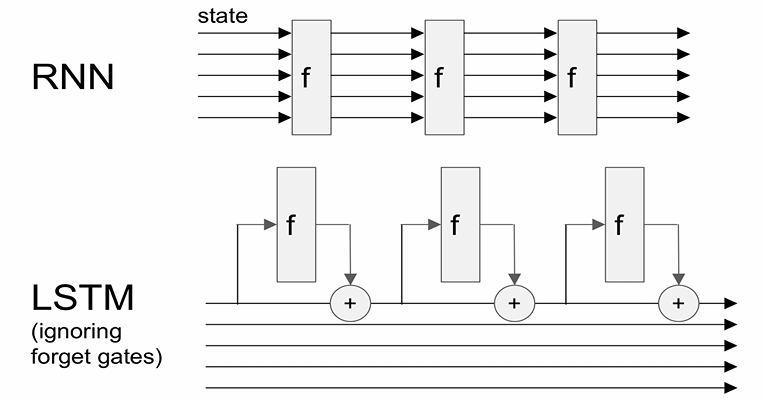

  * +더하기가 가장 중요
  * RNN에서는 backward flow가 굉장히 안좋음
    * If the largest eigenvalue(고유값) is > 1, gradient will explode
      * can control exploding with gradient clipping
    * if the largest eigenvalue is < 1, gradient will vanish
      * can control vanishing with LSTM

 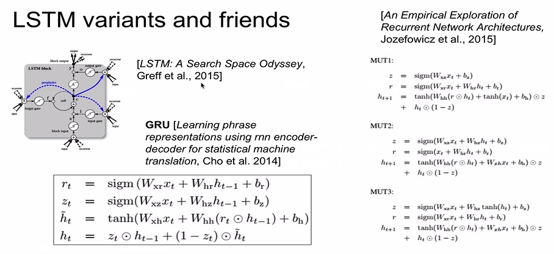

 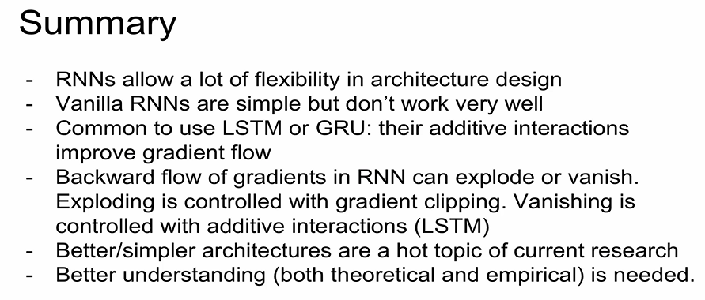
