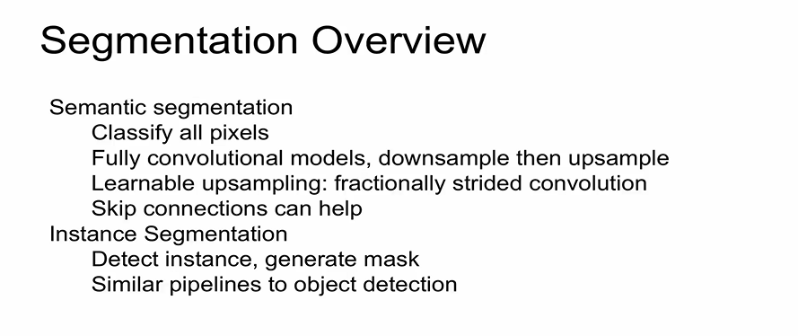

# [13강] Segmentation, Attention

## 1. Segmentation

### Semantic Segmentation

* 특징
  * classification : one label per image
  * semantic segmentation : one label per pixel 
  * 모든 픽셀을 라벨링 한다.
  * instance를 인식하지 못한다.

* 기본 파이프라인
  *  : 비용이 많이 듬
  *  : 이미지 자체를 CNN에 넣어줌
    * 모든 픽셀에 관한 결과를 한번에 구해냄
    * down sampling이 발생함 => out image가 작아짐

* 확장된 버전들 

  * Multi-Scale : 다양한 스케일로 resize => 각각 CNN => up-sampling

    * 

  * Refinement 

    * input 이미지를 3개의 채널(RGB) 분리해서 CNN 적용=> 이미지에 있는 모든 label 얻음
    * => 결과 : 원본보다 down sampling 됨
    * => 다시한번 CNN 적용 => 다시 refinement => 반복!
    * 

  * Upsampling

    * 차이점 : 작아지는 feature map을 복원 = upsampling

    * upsampling 작업 까지도 네트워크의 일부분으로 편입. 

    * 마지막 layer = 학습이 가능한 learnable upsampling

    * 

    * 

    * skip connection : pool 5보다 초기의 pooling 단계에서 또다른 convolutional feature map 추출 => pool 4 => ...

    * Learnable Upsampling : "Deconvolution" (이름 부적절하다.)

      

### Instance Segmentation

* instance 간에 구분함 (Semantic은 instance구분 못함)
* 비교적 최근 방식
* R-CNN과 비슷, but with segments

* 확장된 버전들

  * Hypercolumns

     

  * Cascades

     

* 정리

## 2. Attention

>  

* 연산을 통해 summarize vector를 생성하는 방법

  * Soft vs Hard Attention

    

    

* Soft Attention for Translation

  

* Soft Attention for Everything!

  

* Attending to Arbitrary Regions

  * Attention의 한계점 : fixed grid에 한정되어 attention을 주게됨
  * 임의의 지점에 attention을 줌 : DRAW, Spatial Transformer Network 모델
  * 

  * Spatial Transformer Networks
    * 
    * 

* 정리

