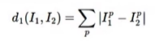
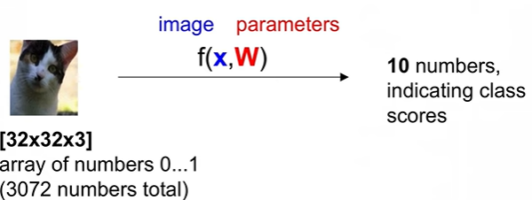
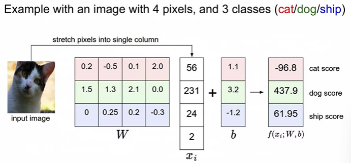

## [2강] Image Classification

#### The problem : semantic gap 의미적 차이

> 사람과 컴퓨터가 인식하는 차이

* 이미지는 3D arrays of numbers
* Challenges 문제점
  * viewpoint 시점
  * illumination 조명
  * Deformation 형태의 변형
  * Occlusion 은폐, 은닉
  * Background clutter 배경과 사물의 구분
  * Intraclass variation 클래스내의 종류의 구분(고양이 종)

* An image classifier

  ```python
  def predict(image):
      # ????
      return class_label
  ```

  * no obvious way to hard-code the algorithm for recognizing a cat, or other classes
    명백한 알고리즘이 존재하지 않는다.

### Data-driven approach

1. 이미지와 라벨로 구성된 dataset 모으기
2. 모여진 dataset을 활용하여 machine learning
3. 새로운 이미지를 학습된 classifier 통해 예측

```python
def train(train_images, train_labels):
    # build a model for images -> lables...
    return model

def predict(model, test_images):
    # predict test_labels using the model...
    return test_labels
```

#### Datasets

* CIFAR-10

  * 10 labels
  * 32 * 32 * 3

  * 50,000 training images

  * 10,000 test images

#### First classifier : Nearest Neighbor Classifier

* train : 모든 이미지와 라벨를 기억하게 함

* predict : 모든 사진과 비교하게 함

* L1 distance : 

  * 이미지1과 이미지2 차의 절댓값

  * predict : for every test image
    * find nearest train image with L1 distance => predict the label of nearest training image

* training data 사이즈의 크기에 비례해서 분류시간이 늘어남

  * train 속도보다 test 속도가 느림
  * test 속도가 빠른게 필요

* K-Nearest Neighbor

  * k 개의 가까운 이미지를 찾고, 다수결로 vote해서 label 찾음
  * 성능이 조금 더 좋다고 알려짐

* hyperparameter : 문제에 따라 실험해보고 가장 적합한것으로 설정해야 하는 것

  * L1 (Manhattan) / L2 (Euclidean) distance
  * K를 뭐를 써야 할지
  * test data는 사용하지 않아야 함
  * Validation data : train data의 20% 정도 = hyperparameter를 설정하기 위해 사용함
    * cross-validation : test set이 적을 때

* K-NN 방법은 이미지에서 활용되지 않음
  * L1/L2 distance가 이미지간 거리를 측정하기엔 적절하지 않음
  * 충분한 training set 모으기 현실적으로 불가능
  * 차원이 증가하면 예측을 위해 비교하는 과정이 기하급수적으로 증가


#### Linear Classification

* parametric approach (이전에는 non parametric approach 였음)

  

  * parameter : W

  * f(x, W) = W*x

    * f(x, W) : 10*1
    * x : 3072*1
    * => W : 10*3072

  * > f(xi, W ,b) = W*xi + b

* Example

  

  * x : 4 * 1
  * f(xi, W< b) : 3 * 1

  * b : 3 * 1
  * => W : 3 * 4 로 맞춰줘야 함
  * => 행렬 연산 
    * cat score = `(0.2*56+(-0.5)*231+...)+1.1` = -96.8
    * 학습이 많이 되지 않아 성능이 저조한 상태


* Interperting a Linear Classifier

  * 이미지내의 모든 픽셀들에 대해서 가중치를 곱하여서 처리를 한 것의 합이다.
    Just a weighted sum of all the pixel values in the image
  * 각각 다른 공간적 위치에 있는 컬러들을 카운팅 하는 것이다. 
    Counting colors at different positions

  * Q : 분간하기 힘든 dataset은 뭘까? 
    * 형태는 같지만 정 반대의 색깔일 때
    * grey 색깔의 이미지들
    * 형태는 다르지만 색깔은 동일한 경우


* So far : We defined a (linear) <u>**Score function**</u> 점수 기반 함수
  * Loss function을 이용해서 score를 loss로 만들어야 함

