# [3강] Loss Functions, optimization

## Loss Function 손실 함수

> 학습을 통해 얻은 데이터의 추정치가 실제 데이터와 얼마나 차이나는지 평가하는 지표로 쓰임. 
> loss 값이 낮을수록 좋은 분류기라고 함
>
> - SVM  - Hinge loss
> - Softmax - Cross entropy loss

### 1. Multiclass SVM loss (힌지 로스)

* (xi, yi) : xj 이미지, yi 라벨
* s = f(xi, W) 

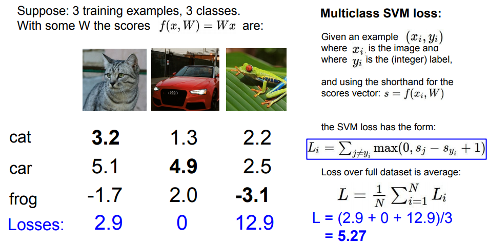

* Sj : 잘못된 labeling score, Syi : 정답 labeling score
* 정답 클래스의 스코어값이 다른 스코어 값+1보다 크면 0, 그렇지 않으면 Sj-Syi+1 값을 갖는다.
* SVM loss 식을 기준으로 loss를 구해보자
  - 개구리 : `max(0, 2.2-(-3.1)+1) + max(0, 2.5-(-3.1)+1) = 12.9` 
    - loss값이 크다는 것을 알 수 있다.
  - 총 Loss 값 : `L = (2.9+0+12.9)/3 = 5.27`
* Q & A
  * j와 yi가 같은 경우도 포함하면? 각 Loss에 1씩 증가 => 전체 평균 Loss도 1 증가함
  * sum 대신에 mean을 사용하면? 상관 없다.
  * 제곱을 사용하면? 결과는 다름. squared hinge loss
  * loss 최대, 최소범위? min : 0, max : inf(무한대)
  * At initialization W is small, so all s = 0. What is the loss? 
    loss = class-1 (디버그용으로 활용, sanity check)

#### Regularization

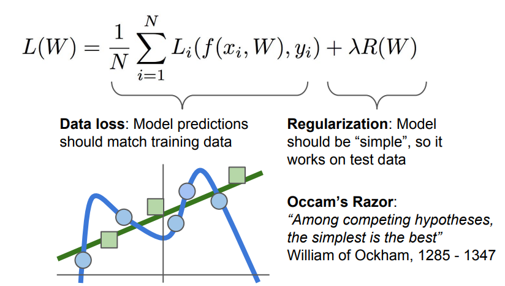

> 파란색 원은 Train data, 초록 네모는 새로운 데이터라고 쳤을 때, 파란색 선은 train data에 overfitting되어 있다고 볼 수 있다. 새로운 데이터는 파란색 선에 의해 예측되지 않는다. 그래서 초록색 선이 파란색 선보다 더 train과 새로운 데이터를 대표한다고 볼 수 있다.

* Weight Regularization

  * 유니크한 weigth를 결정하기 위해서.

    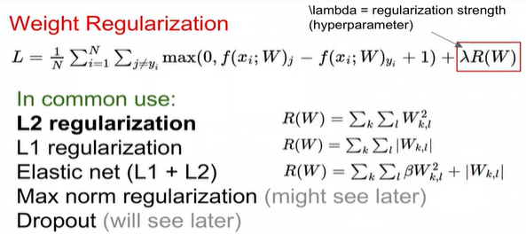

  * 왼쪽항 - data loss : 학습용 데이터들에 최적화하려고 노력

  * 오른쪽 항 - regularization loss : test set쪽에 일반화 하려고 노력

  * 둘이 서로 싸우면서 가장 최적화된, 가장 작은 weigth 값을 추출
    a way of trading off training loss and generalization loss on test set

  * Regularization 종류

    - L2 regularization (일반적으로 사용)
      - w2 를 선호함
      - diffuse over everything 
        모든 input feature들을 고려하려고 함
    - L1 regularization
    - Elastic net (L1+L2)
    - Max norm regularization
    - Dropout
    - Fancier : Batch normalization, stochastic depth

  * <u>Regularization을 사용하면 Train 예측값은 떨어질 수 있지만 Test 예측값의 성능은 끌어올릴 수 있다.</u>


### 2. Softmax Classifier (Multinominal Logistic Regression)

> 다차원으로 일반화

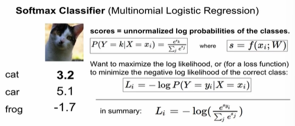

* 모든 스코어를 지수 exp를 취하고 그걸 다 더한 다음에 원하는 클래스의 점수를 exp 취해서 나눈다(확률값)
* 최종적인 목표는 정답 class에 대한 log 확률을 최대화하는 것
* 결국 -log의 확률이 최소화되는 것을 찾고자 하는 것이 목표
* log를 취하는 것은 수학적으로 좀 더 편리하기 때문에 사용

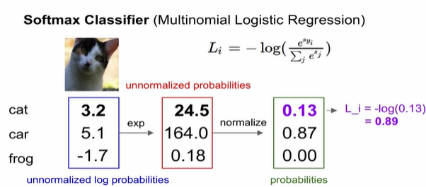

* Q & A
  * loss Li 최대, 최소범위? min : 0, max : inf (log그래프 확인)
  * Usually at initialization W is small so all s = 0. What is the loss ?
    log = class 개수(디버그 용도로 사용, sanity check)


* ### SVM vs Softmax

  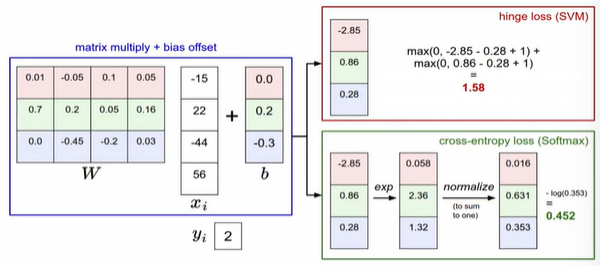

  * SVM : 점수 포인트에 크게 영향이 없음(둔감), safety margin으로 인해 큰 영향을 받지 않음
  * Softmax : 모든 데이터 고려, 확률로 계산되기 때문에 민감하게 영향을 받음

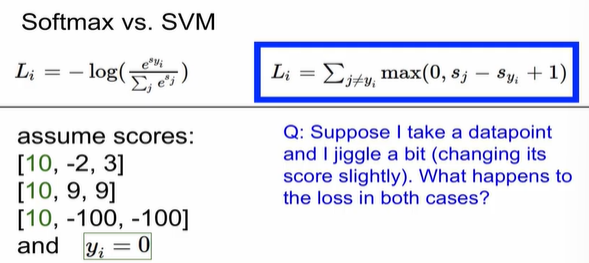


## Optimization 최적화

> loss를 minimize하는 weight를 찾아가는 과정

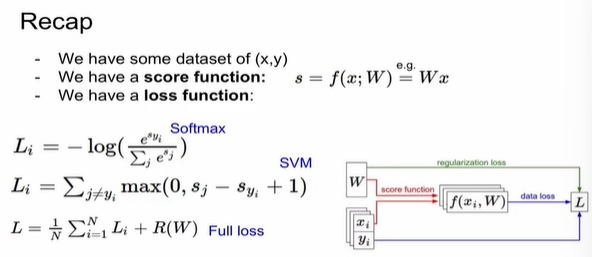

> Regularization의 loss는 데이터에 상관없이 weight에만 영향을 받음

#### Strategy #1 : Random search 임의 탐색

* 랜덤하게 포인트를 찾아내는 방법. 절대 사용하면 안될 것

#### Strategy #2 : Follow the slope 경사 하강법(gradient descent)

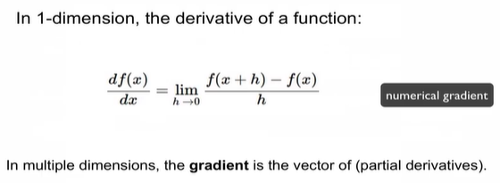

* gradient는 주어진 함수 f(x,y)에 대해서 x 방향으로의 편미분 값과 y 방향으로의 편미분 값을 원소로하는 벡터를 출력
* 예를 들어, `f(x,y) = x^2+y^2+xy` 라고 해보자. 이 때, 각 x, y에 대한 편미분을 해보면 `fx = 2x+y, fy = x+2y `라는 값을 얻게 된다. 여기서 얻어진 fx와 fy는 각각의 단위벡터와 곱해서 더해주면 (2x+y, x+2y)라는 값을 얻게 되는데 해당위치인 x,y를 넣어주면 해당 점에서의 gradient 벡터를 구할 수 있다.

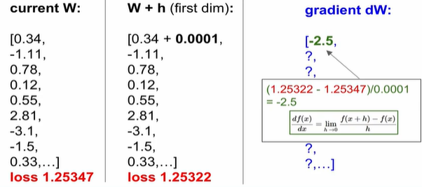

* 우측의 방식(Numerical gradient)으로 각 점에서의 기울기를 구한다. 하지만 하나씩 구하기가 힘들다.

* 정확한 값이 아닌 근사치를 얻게 되고 <u>평가를 하는 것이 느리다</u>. N이 엄청 커지면 각각의 gradient 구하는 것은 실질적으로 어렵다.

  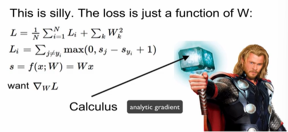

* 미분적분학을 이용해서 계산하는 analytic gradient를 사용하면 편하게 구할 수 있다.

* Summary
  * Numerical gradient : approximate, slow, easy to write
    정확하지 않고고 느리지만 코드로 작성하기 쉽다
  * Analytic gradient : exact, fast, error-prone
    정확하고 빠르지만 코드에서 에러가 나올 가능성이 높다
  * 항상 analytic gradient 방법을 사용하며, 디버깅을 할 때는 numerical gradient를 사용하기도 한다 => **gradient check**

* Gradient Descent

  ```python
  # Vanilla Gradient Descent
  while True:
      weights_grad = evaluate_gradient(loss_fun, data, wieghts)
      weigths += - step_size + weights_grad #perform parameter update
  ```

  > learning rate

* Mini-batch

  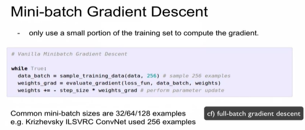

  * 트레이닝 셋중에 일부만 사용해서 효율을 향상시킴

  * step_size : learning rate(알파)

    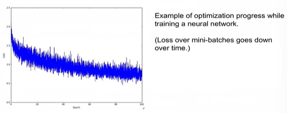

  * loss가 시간에 따라 감소함

  * 노이즈가 많이 보임 -> n개의 데이터만 이용해서 parameter 업데이트하기 때문에 잠깐 증가했다가 감소할 수 있지만 장기적으로 봤을때는 감소

  * learning rate에 따른 영향 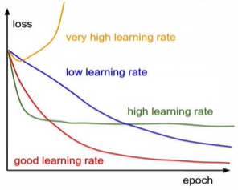

    * decay : 조금 높게 설정했다가 점점 낮추는 방향으로 


### Aside : Image Features

> 이전에 image feature 찾는 방법

* feature 추출 -> 하나로 이음 -> 선형 회귀방식에 적용
* Examples
  * Color Histogram - 색깔 확인
  * HOG / SIFT features - 방향값을 표현
  * Bag of Words - 이미지를 잘라낸 뒤 비지도학습을 이용해서 사전화. 새로운 이미지가 들어오면 사전과 비교해 어떤 특징이 있는지 비교하는 방법(k-means)

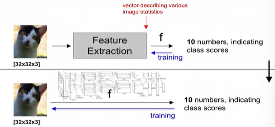

* 이전에는 feature를 추출했지만 이제는 feature를 추출하지 않음
* 이미지 자체를 function에 넣어주면 결과를 추출함 => CNN

