# [4강] Backpropagation and Neural Networks

## 1. Backpropagation 오차역전파법

* Computational Graph 

  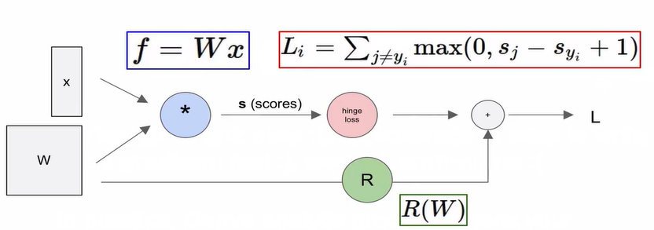

  > input x, W인 선형 classifier
  >
  > hinge l은 oss라는 계산 노드를 통해 데이터항 Li를 계산한다.
  >
  > 노드 R은 regularization 항을 

  * 왼쪽에서 L방향으로 가는 것 : Forward propagation(FP) - input이 얼마나 영향을 미치는지

  * input값에 대한 영향력구하기 위해 역방향, Backpropagation 사용

  * 가중치의 gradient를 효율적으로 계산하기 위해서 사용하는 방법. gradient는 모델 성능을 높이기 위해서 loss값을 줄이기 위한 방향을 결정하는데 필요하다. 단순하게 미분을 해서 gradient를 구해도 되지만 시간이 오래 걸리는 단점이 있다.

    

* Example

  

  > 빨간숫자  = gradient

  * 위의 그림에서 우리의 목표는 f를 x,y,z로 미분했을 때의 값을 구하고자 하는 것 입니다.
    - 초록색 부분은 특정한 값을 넣었을 때의 f값이 되겠습니다.
    - 우선 가장 끝부분(가장 우측 -12)은 df/df 이므로 1이라고 작성하였습니다. 
  * 곱하기(gradient switcher) 
    - 그 다음 역순으로 올라가보면 df/dz를 구하기 위해서는 위쪽에 있는 q의 값과 df/df값을 곱한 값이 되겠습니다.
    - 반대로 df/dq를 구하는 것은 z*df/df인 -4가 되겠습니다.
  * 더하기(gradient distributor)
    - 쉽게 생각하면 df/dx는 체인 룰에 의해 df/dq*dq/dx가 됩니다. 여기서 dq/dx=1이므로, df/dx = df/dq가 되겠습니다.
    - df/dy도 동일한 과정에 의해 df/dq와 동일한 값을 얻게 됩니다.

  * Chain rule 연쇄 법칙 
    * 합성함수의 미분은 합성 함수를 구성하는 각 함수의 미분의 곱으로 나타낼 수 있습니다.
    * `df/dq` : global gradient
    * `dq/dy` : local gradient

  * Backward Pass = Backpropagation

    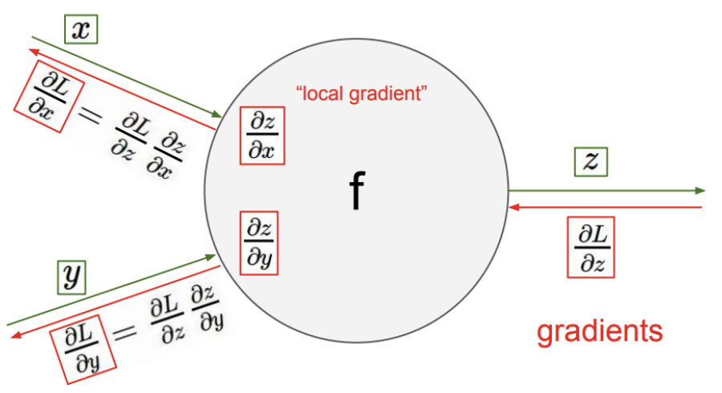

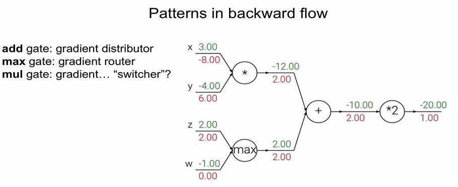

* gradient
  * 더하기 : 그대로 전해짐
  * max : 더 큰 값 한개만
  * branch 한개가 두개로 나눠지는 경우 = 뒤에 두개의 gradient 값을 더하면 앞의 하나의 gradient 값이 됨

* Implementation

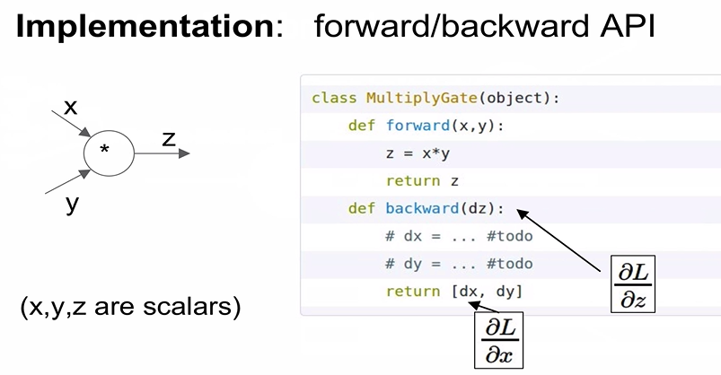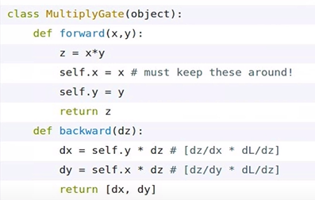

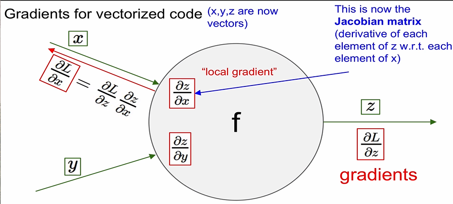

* Jacobian Matrix
  - Jacobian Matrix는 선형대수에서 나오는 데, 편미분 변수를 구해야할 것이 많을 때 사용하는 matrix라고 보면 되겠습니다.

## 2. Neural Network

: without the brain stuff

* before : Linear score function `f = Wx`

* now : 2-layer Neural Network `f = W_2*max(0, W_1x)`

  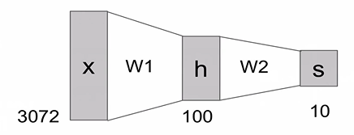

>  data approach
>
> - non-parameteric approach - Near Neighbor : 하나의 class, 하나의 classifier 만 존재
> - parameteric approach - Neural Network : 하나의 class, 여러개의 classifier 존재

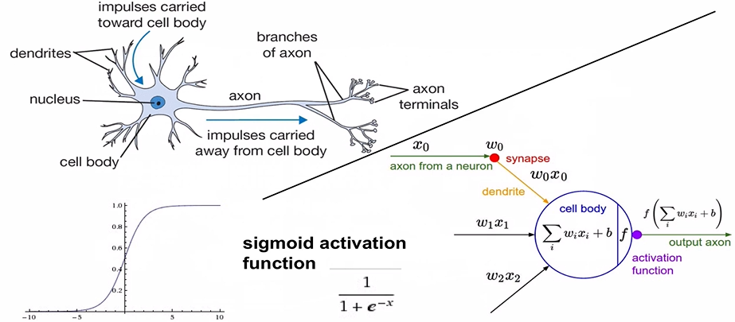

* Activation function 활성함수
  * sigmoid : 가장 많이 사용 
  * tanh(x)
  * ReLU : max(0,x)
  * Leaky ReLU : max(0.1x,x)
  * Maxout 
  * ELU 

* 신경망 구조

  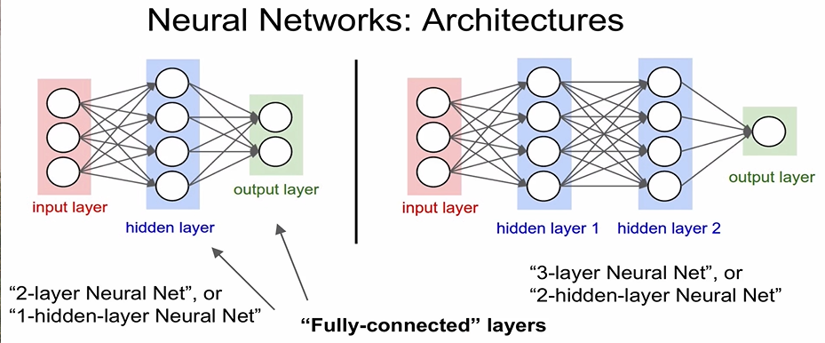

  > Neural networks 구조는 위와 같이 input layer, hidden layer, output layer로 구성되어 있습니다. 또한 모든 레이어의 노드끼리 연결되어있는 상태를 Fully-connected라고 합니다.

* Do not use size of neural network as a regularizer. Use Stronger regularization instead: 

  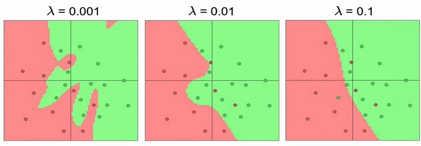

  * 사이즈가 일반화의 역할을 하는 것은 아니다.
  * 람다 값을 바꿔야 함

* Summary

  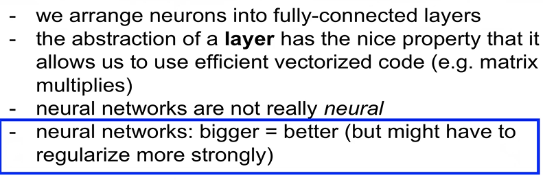
