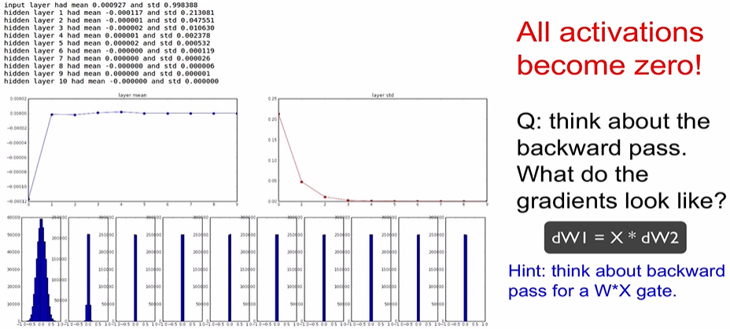
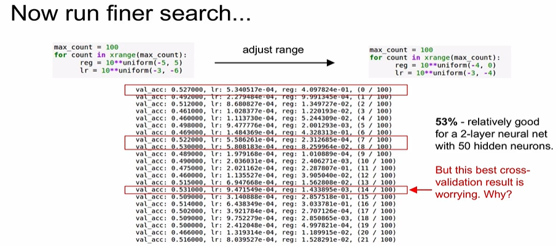

# [5강] Training NN part 1

### - Activation Functions 활성 함수

> Layer로 데이터 입력이 들어오면 (FC나 CNN에)가중치를 곱하고, 활성함수, 즉 비선형 연산을 거친다.

#### 1. Sigmoid

#### 2. Tanh

#### 3. ReLU

* 입력이 음수면 값이 0이 된다. 양수면 입력 값 그대로 출력한다.
* 상당히 자주 쓰인다.

* Dead ReLU : gradient의 절반을 죽여버림
  * 초기화를 잘못 한 경우
  * Learning rate가 지나치게 높은 경우

#### 4. leaky ReLU

* 음수에서도 saturation 되지 않는다.
* 완전히 검증된 건 아님.

* PReLU (parametric rectifier) : 알파를 학습시킴

#### 5. ELU

#### 6. Maxout Neuron

* 파라미터가 2개라 연산이 2배

#### => 실제로 ReLU가 가장 많이 쓰임

### - Data Preprocessing 데이터 전처리

### - Weight initialization 가중치 초기화

* 모든 가중치=0 => 모든 뉴련이 같은 일을 할 것. 

* 가중치를 동일하게 초기화 시킬 수 없다. => Symmetry breaking이 일어날 수 없다.

* => 해결방법 1 : random 작은 값으로 초기화하는 것. => 더 깊은 네트워크에서 문제가 생길 수 있음

> W를 곱하면 곱할수록 모든 활성함수 결과가 0이 되어버림.

> 가중치를 큰 값으로 초기화했을 때 => 출력이 항상 1 아니면 -1이 됨.

* => 가중치가 너무 작으면 사라져버리고, 너무 크면 saturation 된다.

#### Xavier initialization

* 입출력의 분산을 맞춰준다.
* 입력수가 작으면 더 작은값으로 나누고 좀 더 큰값을 얻음. 더 큰 가중치가 필요
* 입력수가 많으면 더 작은 가중치가 필요
* but, ReLu(비선형)를 쓰면 잘 작동하지 않음.

* ReLU는 출력의 절반을 죽이고 그 절반은 매번 0이 되기 때문에 출력의 분산을 반토막 내버림 => 많은 값들이 0이 되고 결국 비활성됨
* 해결하기 위해 : 2로 나눠줌 => 좋은 분포 형성

### - Batch Normalization 배치 정규화

* 각 layer를 거칠 때마다 normalization을 해주자.
* consider a batch of activations at some layer

* 정규화 => 정규화 된 것을 조정 (감마, 베타 : 학습을 통해 결정)
* => normalization을 어느정도 할 것인가 (오른쪽처럼 하면 정규화를 상쇄시킴)

* traning 할때와 test 할때 다름

### - Babysitting the Learning Process

* Step 1 : Preprocess the data 데이터 전처리
* Step 2 : Choose the architecture
  * hidden layer 몇개, 각 레이어별 노드 몇개

* learning rate=1e-6 (작음) => loss not going down
* learning rate = e^6 (큼) => NaN = loss exploding
* learning rate = 3*e-3 => still too high
* => Rough range for learning rate = [1e-3 ... 1e-5]

### - Hyperparameter Optimization

* Cross-validation strategy
  * 반복을 적게 => Hyperparameter 를 찾아감
  * 

* Hyperparameters to play with:
  * network architecture
  * learning rate, its decay schedule, update type
  * regularization (L2/Dropout strength)

