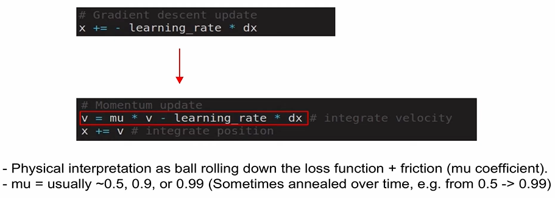
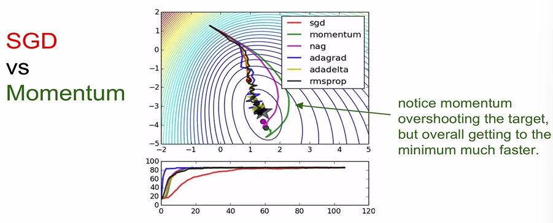
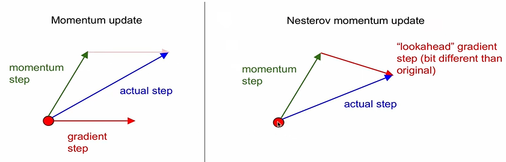
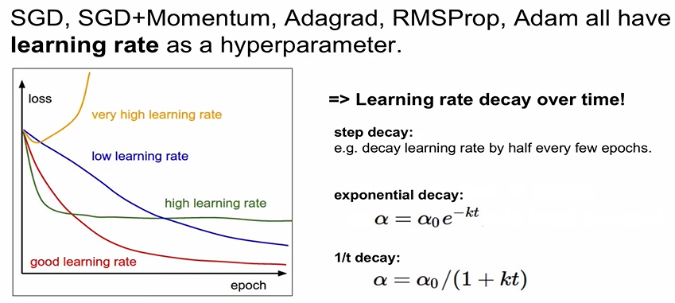
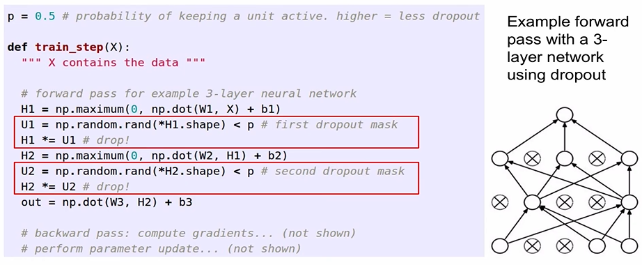
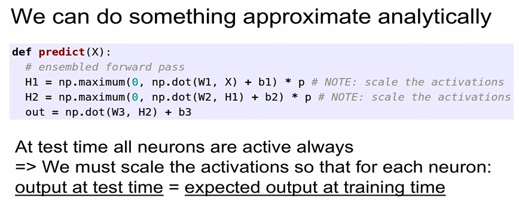
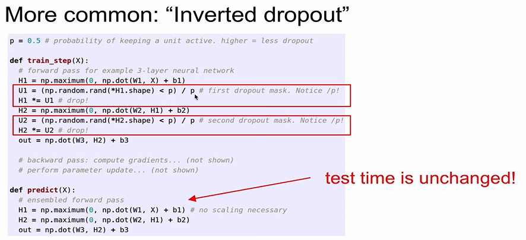

# [6강] Training NN part 2

### - Parameter update schemes

* Momentum update

  

  > mu : 마찰계수 (설정됨)

  

* Nesterov Momentum update

  

* 많은 방법들 = First order optimization methods (gradient만 사용)
* 요즘은 Adam

### - Dropout - regularization

* randomly set some neurons to zero in the forward pass
  일부를 0으로 설정
* At training time ...

* why good?
  * Forces the network to have a redundant representation
    중복을 가짐
  * training a large ensemble of models
* At test time ...
  * dropout 사용하지 않음

