# [7강] CNN

## Convolutional Neural Network

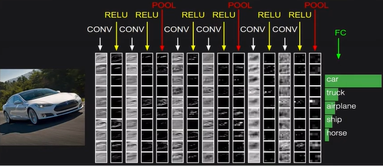

* #### Convolution Layer

  * Convolve the filter with the image (필터를 이미지 위에 convolve)
  * Filters always extend the full depth of the input volume. 
    이미지와 필터가 크기는 달라도 dept는 항상 같다.

  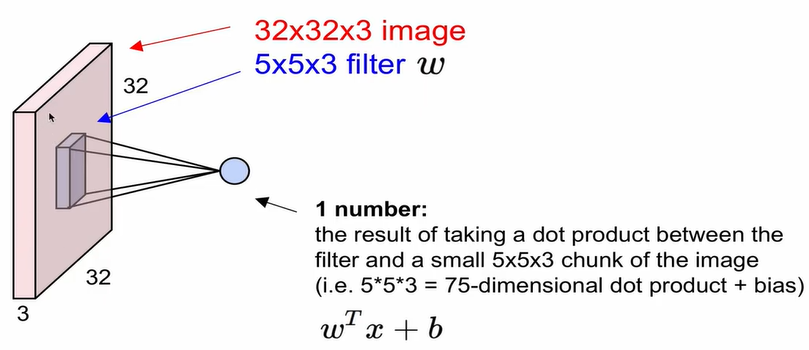

  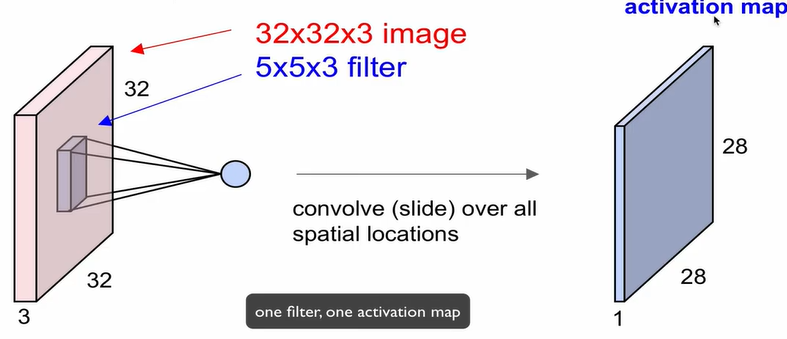

  * **one filter, one activation map**

    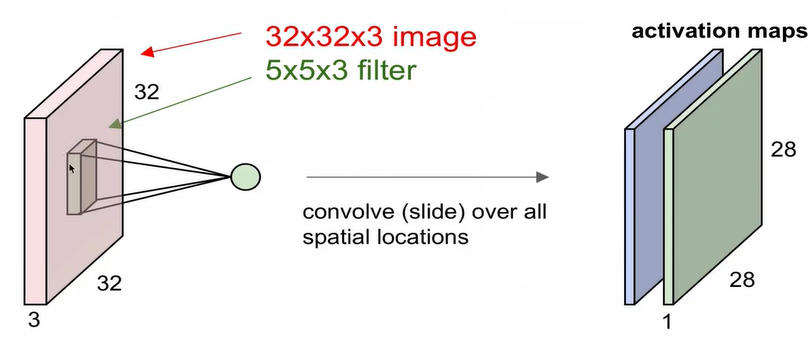

  * consider a second, green filter `28*28*1`

  * Ex ) 5*5 filter 6개 =(re-representation)=> 6개의 activation maps (new image size `28*28*6`) 

  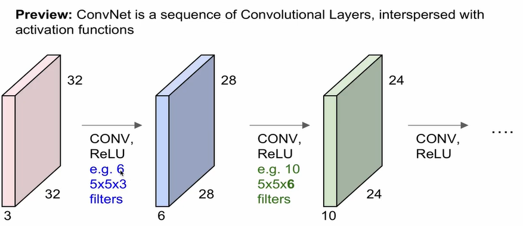

  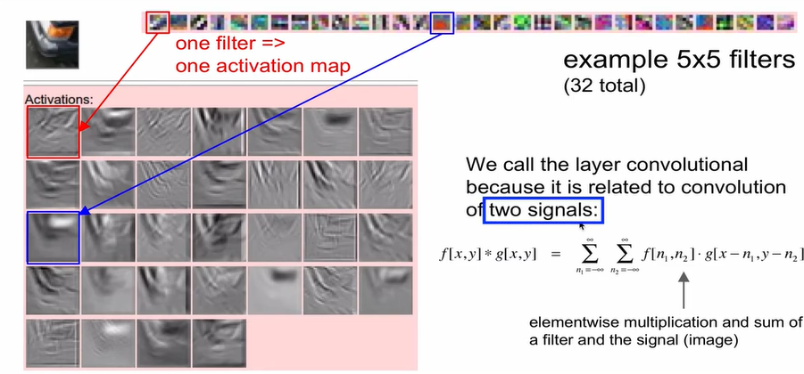

  * 32개의 5*5 filter => activation map보면 오렌지 부분만 흰색
    * 하얀색 부분이 activation이 높은 지점, 검은색이 낮은지점
  * 2개의 시그널이 convolution 작용을 한다.(필터와 이미지간)

* Spatial dimension

  * 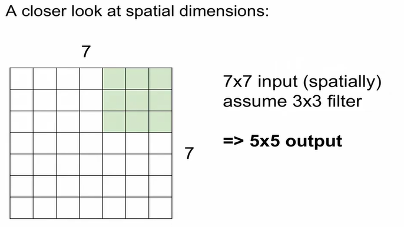 : stride = 1

  * 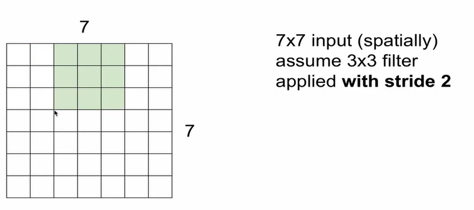 : stride = 2 (2칸씩 이동)

    → 3 * 3 output

  * 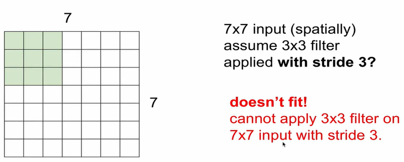 : stride = 3

  * 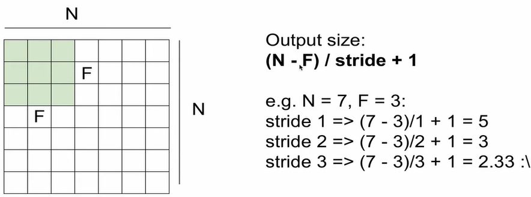 

    * Output size = `(N-F) / stride + 1`

  * Padding : Common to zero pad the border

    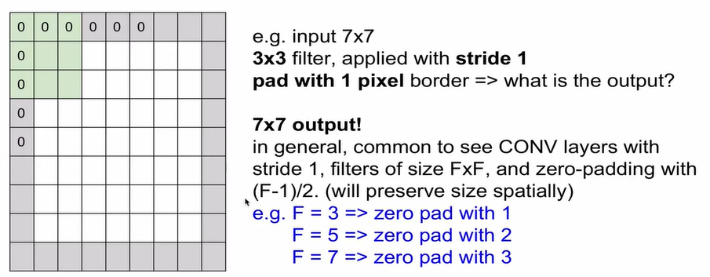

    * padding을 주면 사이즈가 그대로 보존됨
    * 원래대로 convolution을 계속 진행하면 사이즈가 계속 줄음 => padding이 매우 유용함

  * Example

    * Input : `32*32*3` , 10개의 5*5 filters with stride 1, pad 2
    * Output : (32+2*2-5)/1+1 = 32, so `32*32*10`
      ←`(이미지32 + 패딩2*2 - 필터5)/stride(1) + 1`
    * Number of parameters in this layer (필터의 수): 
      * each filter : `5*5*3 + 1 = 76 ` (+1 for bias) => `76*10=760`

  * Summary

    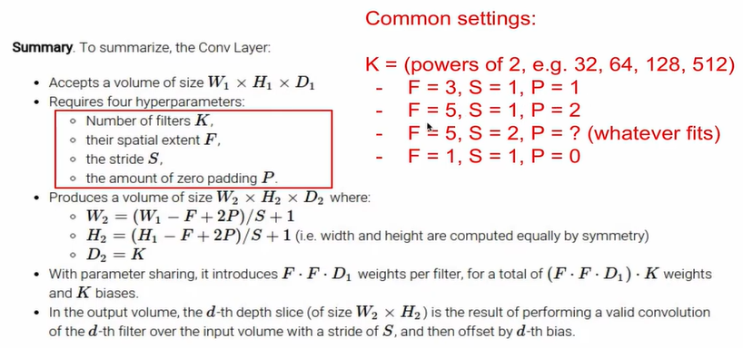

    * Accept volume of size W1 * H1 * D1
    * 4가지의 hyperparameters 필요 : filter의 개수`K`, 크기`F`, stride`S`, padding`P`
    * Produces volume of size W2 * H2 * D2
      * W2 = (W1 - F + 2P)/S + 1
      * H2 = (H1 - F + 2P)/S + 1
      * D2 = K `(dept는 동일하다)`
    * 각각의 필터 Weight = `F*F*D1`
      * `(F*F*D1)*K` = Weight의 총 개수
    * 필터의 개수 K = 보통 2의 자승
    * 1*1의 convolution도 의미가 있다.

* Neuron view of CONV Layer

  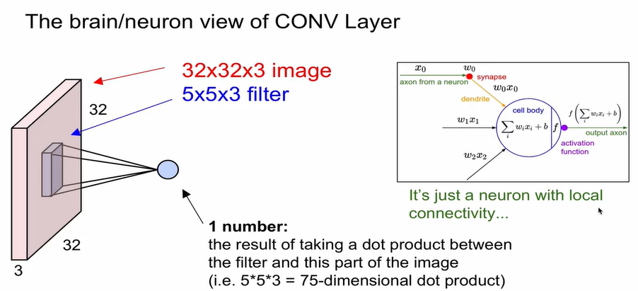

  * 뉴론이 살펴보는 field : receptive field (왼쪽 분홍색)
  * 뉴론이 local connectivity를 가진다.
  * An activation map is a 28*28 sheet of neuron outputs:
    * Each is connected to a small region in the input
    * All of them share parameters
  * `5*5` filter => `5*5` receptive field for each neuron

* #### Pooling layer

  * volume의 representation을 작게, 관리할 수 있게 만들어줌

  * 각각의 activation에 대해 독립적으로 작동

    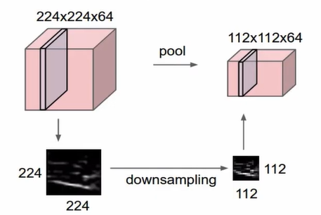 (224  → 112)

  * convolutional layer에서는 사이즈를 유지, pooling layer에서 사이즈를 downsampling

  * 즉, 사이즈는 pooling layer에서 관리한다. 

  * parameter, padding이 없다.

  * 방법

    * MAX POOLING

      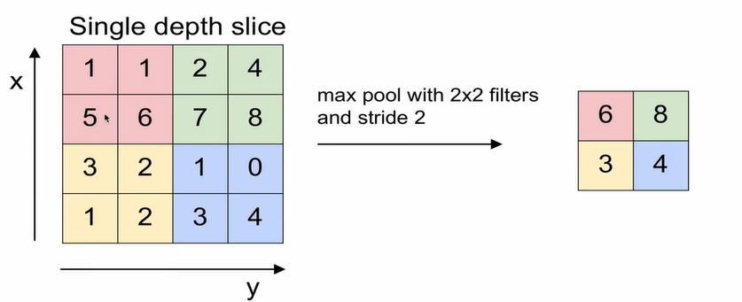

      * output size = (n-f)/s + 1 
      * 약간의 정보를 손실하면서 invariance 능력을 얻게된다.

  * Summary

    * Accept volume of size W1 * H1 * D1
    * 2가지의 hyperparameters 필요 : filter의 크기`F`, stride`S`
    * Produces volume of size W2 * H2 * D2
      * W2 = (W1 - F)/S + 1
      * H2 = (H1 - F)/S + 1
      * D2 = D1 `(dept는 동일하다)`
    * Common settings
      * F = 2, S = 2
      * F = 3, S = 2

* #### Fully Connected Layer (FC layer)

  * Contains neurons that connect to the entire input volume, as in ordinary Neural Networks
  * 결과적으로 softmax에서 10가지 중에 class를 구분하게 하는

* Case Studies
  * VGG(2014)
  * GoogLeNet(2014)
  * ResNet(2015)

* Summary

  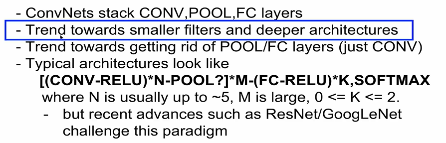

