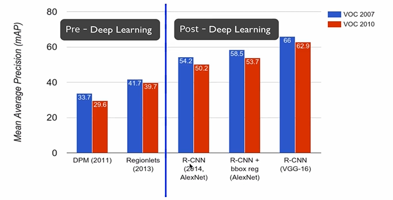

# [8강] Localization, detection

>  Computer Vision Tasks
>
> 
>
> * Localization : 어디에 있는지 boxing
> * Detection : 여러개의 object를 찾아내는 것
> * Segmentation : 형상대로 따주는 것

### Classification + Localization

#### Idea #1 : Localization as Regression 

* 결과물로 4개의숫자로 구성된 박스 좌표를 얻어서 비교, L2 distance로 Loss 계산
  * Step 1 : Train a classification model (AlexNet, VGG, GoogLeNet)
  * Step 2 : Attach new fully-connected "regression head" to the network
    * 결과물이 Box coordinates로 되도록 추가
  * Step 3 : Train the regression head only with SGD and L2 Loss
    * 추가했던 부분만 학습해줌
  * Step 4 : At test time use both heads 
    * classification head + regression head 모두 이용해서 결과물 산출

* Regression head 2가지 방법 (loss계산 방법에만 차이)

  

  * Per-class : 클래스에 특화됨
    * 각 클래스당 하나의 박스 (4개의 숫자가 각 클래스별로 나옴)
  * class agnostic : 클래스와 무관함(범용적)
    * 하나의 박스 (4개의 숫자만 결과물로 나옴)

* Regreesion head를 어디에 붙여야 하는지?

  * After conv layers 마지막 CONV layer 뒤에다가 : Overfeat, VGG
  * After last FC layer 마지막 FC layer 뒤 : DeepPose, R-CNN

* 정리 : 쉽고 강력하다.

#### Idea #2 : Sliding Window

* classification + regression => 이미지 여러군데의 위치에 여러번을 돌리고 합쳐줌
* 편의성을 위해 fully-connected layer를 convolutional layer로 변환해서 연산

* #### Overfeat

  

  *  →

  * sliding window를 옮기며 각 score 계산 

    * 최종적으로 4개의 bounding box, 4개의 score가 나옴
    * => 4개를 합쳐서 단일의 bounding box, score 얻음

  * 실제로 수많은 sliding window를 사용

    

  * 연산이 heavy 해짐

    * FC => Convolutional layer로 변환

    

### Object Detection

#### Detection as Regression

> 사진의 object 개수에 따라 output의 개수가 달라짐  => regression 적당하지 않음

* YOLO : You Only Look Once

  

#### Detection as Classification

> 영역을 보고 cat? no, dog? yes

* 문제 : 

  * Need to test many positions and scales, 
  * and use a computationally demanding classifier (CNN) 무거운 classifier 사용

* 해결 : 

  * If you classifier is fast enough, just do it.
  * Only look at a tiny subset of possible positions 
    전 지역 말고 의심지역만 보자 (Region proposal 방식)

* Region proposals

  

  * find blobby : 유사한 색상이나 텍스쳐 찾음
  * class와 무관한 detector
  * Selective Search

* **R - CNN** : region proposal + ConvNet

  

  * Step 1 : Train a classification model for ImageNet (AlexNet)
  * Step 2 : Fine-tune model for detection
    * 1000 => 21개 classes
  * Step 3 : Extract features 
    * region proposals 추출 => 각각 region - CNN 돌림 - pool5 feature 디스크에 저장
  * Step 4 : Train one binary SVM per class to classify region features
    * ex) 강아지 클래스 : 강아지 인지 아닌지 (negative or positive)
  * Step 4 : For each class, train a linear regression model to map from cached features to offsets to GT boxes to make up for "slightly wrong" proposals
    * box를 보정하는 역할

* Evaluation
  * We use a metric called "mean average precision" (mAP)

* R-CNN Results
  * 

* R-CNN Problems
  * Slow at test time : 각 region proposal(2000개)에 대해 foward pass로 CNN을 돌려야함
  * SVMs and regressors are post-hoc : CNN features가 바로바로 업데이트 되지 못함
  * Complex multistage training pipeline : 다단계의 training pipeline 복잡함

* **Fast R-CNN** (test time)
  * CNN 돌린 후 Region 추출
  * Solution : Share computation of convolutional layers between proposals for an image
    첫번째 문제 해결 => 빠르게 동작
  * Solution : Just train the whole system end-to-end all at once
    두번째, 세번째 문제 해결 => 전체 시스템을 한번에

* **Faster R-CNN** 

  

  * Region Proposal Network

    

### Recap

