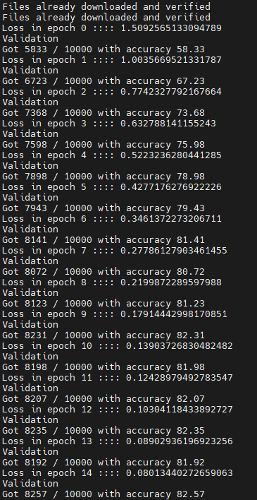
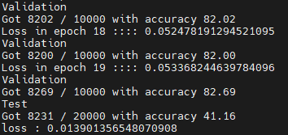
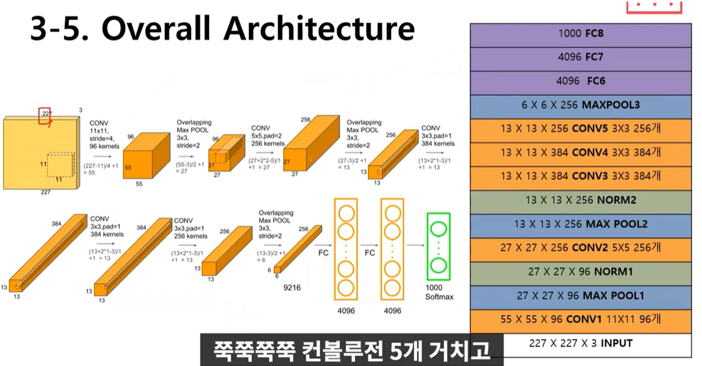

# CNN Network layer 모델

>  CNN 아키텍처
>
>  

## 1. Alexnet




* 최초로 제안된 거대한 크기의 CNN 아키텍처
* 특징들
  * Overlapping Pooling Layer : 필터를 겹치게 stride를 좁혀서 사용
  * ReLu 활성함수 사용 : tanh에 비해 학습속도가 6배 빠름
  * Local Response Normalization(LRN) 사용 : 활성화 함수를 적용하기 전에 미리 적용하여 함수의 결과값에서 더 좋은 일반화 결과를 도출. 
    * 강하게 활성화된 뉴런의 주변 이웃들에 대해 normalization 실행.
    * 이유 : 인접화소들을 억제시키고 특징을 부각시키기 위함 
    * 정확도가 1.4% 정도 향상
    * ReLU의 사용 => 매우 높은 하나의 픽셀값이 주변의 픽셀에 영향을 미치게 됨
    * 방지하기 위해 다른 activation map의 같은 위치에 있는 픽셀끼리 정규화를 함
  * Dropout 사용 : FC 레이어에서 50%확률의 Dropout 적용. Overfitting을 줄여줌.
    * Overfitting : 컴퓨터가 주어진 데이터에만 너무 최적화되어서 새로운 데이터에 대한 예측을 못하는 현상. <-> Underfitting
  * Training on Multiple GPUs
  * Data Augmentation : 동일한 이미지들을 조금씩 변형시켜가며 학습. 데이터양을 늘림.
    * mirroring, Random Crops, PCA Color Augmentation기법 등
    * 데이터 양을 2048배 늘림
* [Input layer - Conv1 - MaxPool1 - Norm1 - Conv2 - MaxPool2 - Norm2 - Conv3 - Conv4 - Conv5 - Maxpool3 - FC1- FC2 - Output layer] 
* 8개의 레이어
  * Convolution layer : 5개
  * Pooling layer : 3개
* Local Response Normalization layer : 2개
* Fully-connected layer : 3개
* 뉴런 약 65만개
* 파라미터 약 6200만개
* 연산량 약 6억 3000만개
* Pooling Layer 역할 : 처리되는 데이터의 크기를 줄임. 크기를 줄이며 특정 feature 강조




* 입력 : 227 * 227 * 3 이미지 (채널 = 3 (RGB) )

* 첫번째 layer (채널 96개) => 출력 : `55*55*96` `(<= (227-11)/4+1=55)`
  
  * filter : 96개의 `11*11*3` 필터가 stride 4로 적용
  * 파라미터 : `(11*11*3)*96 = 35K`
  * POOL 1 : 3*3필터 stride 2로 적용 =>  `크기 : 55 -> 27` `(<= (55-3)/2+1 = 27)`
  * activation : ReLU + LRN + MaxPooling
  
* 2nd layer(Conv) (채널 : 96 -> 256개) => 출력 : `27*27*256` 

   * filter : 5x5x48. 256개 
   * POOL 2 : 3*3 필터 stride 2 `크기 : 27 -> 13` `(<= (27-3)/2+1=13)`
   * activation : ReLU + LRN + MaxPooling

* 3rd layer(Conv) (채널 : 256 -> 256개) => 출력 : `13*13*256` 

   \- filter : 3x3x256. 384개 

   \- activation : ReLU

   \- 유일하게 이전 layer에서 모든 kernel map들과 연결굄

* 4th layer(Conv) (채널 : 256 -> 384개) => 출력 : `13*13*384` 

   \- filter : 3x3x192. 384개

   \- activation : ReLU

* 5th layer(Conv) (채널 : 384 -> 256개) => 출력 : `6*6*256` 

   \- filter : 3x3x192. 256개

   \- activation : ReLU + MaxPooling `크기 : 13 -> 6`

* 6th layer(FC)

   \- Neurons : 4096

   \- activation: ReLU

* 7th layer(FC)

   \- Neurons : 4096

   \- activation : ReLU

* 8th layer(FC)

   \- Neurons : 1000

   \- activation : Softmax

```python
import torch
import torch.nn as nn
import torch.optim as optim
import torch.nn.functional as F
from torch.utils import data
import torchvision.datasets as datasets
import torchvision.transforms as transforms

device = torch.device('cuda' if torch.cuda.is_available() else 'cpu')
device   # cuda 지정
```

```python
# 논문 5. Details of learning 참고 parameter
batch_size = 128
momentum = 0.9
lr_decay = 0.0005
lr_init = 0.01
image_dim = 227    # pixels
num_classes = 1000   # 1000개의 class 지정
device_ids = [0, 1, 2, 3]
```

```python
class AlexNet(nn.Module):
  def __init__(self, num_classes=1000):
    super().__init__()
    ##### CNN layers 
    self.net = nn.Sequential(
        ## conv1
        nn.Conv2d(in_channels=3, out_channels=96, kernel_size=11, stride=4),
        	# 입력채널수=3, 출력채널수=96, 필터크기=11*11, stride=4, 패딩=0
        nn.ReLU(inplace=True),  # non-saturating function
        	# ReLU함수 사용
        nn.LocalResponseNorm(size=5, alpha=0.0001, beta=0.75, k=2),  
        	# NORM1 : 논문의 LRN 파라미터 그대로 지정 
        	# 정규화 k=2, n=5, 알파=0.0001, 베타=0.75
        nn.MaxPool2d(kernel_size=3, stride=2),
        	# 풀링layer : 필터크기=3*3, stride=2
        
        ## conv2
        nn.Conv2d(96, 256, kernel_size=5, padding=2), 
        	# 입력채널수=96, 출력채널수=256, 필터크기=5*5, stride=1, 패딩=2
        nn.ReLU(inplace=True),		# ReLU함수 사용
        	# ReLU함수 사용
        nn.LocalResponseNorm(size=5, alpha=0.0001, beta=0.75, k=2),
        nn.MaxPool2d(kernel_size=3, stride=2),		
        	# 풀링layer : 필터크기=3*3, stride=2
        
        ## conv3
        nn.Conv2d(256, 384, 3, padding=1),
       		# 입력채널수=256, 출력채널수=384, 필터크기=3*3, stride=1, 패딩=1
        nn.ReLU(inplace=True),
        
        ## conv4
        nn.Conv2d(384, 384, 3, padding=1),
        	# 입력채널수=384, 출력채널수=384, 필터크기=3*3, stride=1, 패딩=1
        nn.ReLU(inplace=True),		# ReLU함수 사용
        
        ## conv5
        nn.Conv2d(384, 256, 3, padding=1),
        	# 입력채널수=384, 출력채널수=256, 필터크기=3*3, stride=1, 패딩=1
        nn.ReLU(inplace=True),		# ReLU함수 사용
        nn.MaxPool2d(kernel_size=3, stride=2),
        	# 풀링layer : 필터크기=3*3, stride=2

    )

    ##### FC layers
    self.classifier = nn.Sequential(
        # fc1
        nn.Dropout(p=0.5, inplace=True),
        nn.Linear(in_features=(256 * 6 * 6), out_features=4096),
        	# 선형 변환 : input=256*6*6, output=4096
        nn.ReLU(inplace=True).
        # fc2
        nn.Dropout(p=0.5, inplace=True),
        nn.Linear(4096, 4096),
        nn.ReLU(inplace=True),
        nn.Linear(4096, num_classes),
    )
    
    # bias, weight 초기화 
    def init_bias_weights(self):
      for layer in self.net:
        if isinstance(layer, nn.Conv2d):
          nn.init.normal_(layer.weight, mean=0, std=0.01)   # weight 초기화
          nn.init.constant_(layer.bias, 0)   # bias 초기화
      # conv 2, 4, 5는 bias 1로 초기화 
      nn.init.constant_(self.net[4].bias, 1)
      nn.init.constant_(self.net[10].bias, 1)
      nn.init.constant_(self.net[12].bias, 1)
    # modeling 
    def forward(self, x):
      x = self.net(x)   # conv
      x = x.view(-1, 256*6*6)   # keras의 reshape (텐서 크기 2d 변경)
      return self.classifier(x)   # fc   
```

```python
if __name__== '__main__':
  seed = torch.initial_seed()  # seed value 설정
  model = AlexNet(num_classes=num_classes).to(device)
  model = torch.nn.parallel.DataParallel(model, divice_ids=device_ids)  # 모델 설정
  print(model)

  # dataset, data loader 설정
  dataset = datasets.ImageFolder(TRAIN_IMG_DIR, transforms.Compose([
      transforms.CenterCrop(IMAGE_DIM),
      transforms.ToTensor(),
      transforms.Normalize(mean=[0.485, 0.456, 0.406], std=[0.229, 0.224, 0.225]),
  ]))

  dataloader = data.DataLoader(
      dataset,
      shuffle=True,
      pin_memory=True,
      num_workers=8,
      drop_last=True,
      batch_size=batch_size)

  # optimizer
  optimizer = optim.SGD(
      params = model.parameters(),
      lr = lr_init,
      momentum = momentum,
      weight_decay = lr_decay  # lr 점점 감소
  )

  lr_scheduler = optim.lr_scheduler.StepLR(optimizer, step_size=30, gamma=0.1)   # lr 점점 감소

  # training
  total_steps=1
  for epoch in range(num_epochs):
    lr_scheduler.step()

    for imgs, classes in dataloader:
      imgs, classes = imgs.to(device), classes.to(device)

      output = alexnet(imgs)
      loss = F.cross_entropy(output, classes)  # loss 계산

      optimizer.zero_grad()
      loss.backward()  # backpropa
      optimizer.step()  # parameter update
```


## 2. VGG

* 네트워크의 깊이를 깊게 조절하는 것이 CNN의 성능에 어떤 영향을 주는지 확인하고자 함

  * 필터의 크기 3x3으로 설정, 64개로 합성곱 연산
  * 3x3필터를 여러번 사용하는 방법은 이론적으로 5x5필터를 한번 사용하는 것과 동일한 성능이여야 하지만, 테스트한 결과 3x3 여러번사용이 더 좋은 성능을 보였다.
    * 필터의 중첩이 활성화 함수 ReLU를 더 많이 사용, 최종적으로 정보를 분류하는 결정함수가 더 잘 학습하도록 영향을 끼침
    * 학습해야할 파라미터의 수가 줄어들기 때문, 학습 속도에 긍정적 영향

* 구조가 간단하지만 GoogleNet과 에러 0.1% 차이

  * GoogleNet이 성능이 가장 좋지만 구조가 복잡하여 사용하기 어려움 

* 작은 필터를 여러층으로 쌓는 ResNet의 모체

* Small Filter Size & Deep Networks

* AlexNet과 차이점

  * AlexNet에서 11x11, 5x5와 같은 넓은 크기의 커널로 Convolutation연산을 적용하는 것보다 여러 개의 3x3 Convolution 연산을 수행하는 것이 더 뛰어난 Feature를 추출합니다.
  * AlexNet 대비 더 많은 채널수와 깊은 Layer 구성
  * 3x3 크기의 커널을 연속해서 Convolution 적용한 뒤에 Max Pooling 적용하여 Convolution Feature map Block을 생성
  * Block 내에는 동일한 커널 크기와 Channel 개수를 적용하여 동일한 크기의 feature map들을 생성
  * 이전 Block 내에 있는 Feature Map의 크기는 2배로 줄어들지만 채널은 2배로 늘어남

* 모델링

  * Convolutional Layer를 3*3 필터, Padding=1로 원본크기에 변화를 주지 않음
  * Max-pooling을 사용해 사이즈를 절반으로 줄여나가면서 특징들을 추출
    * kernel 2x2, stride 2로 이미지를 절반으로 resize
  * 각각의 Conv Layer뒤에 활성화 함수로 ReLU를 사용
  * FC Layer로 4096, 4096, num_classes=1000으로 3개의 층
  * 중간중간 Dropout 0.5 주었다.
  * 최종결과 Softmax

* 최적화

  * Batch Size 256, momentum 0.9, 
  * Learning Rate 0.01- lr에 0.1을 곱했고 총 3번 곱했다

* 층수에 따라 16개 층은 VGG16, 19개 층은 VGG19라고 불림

* 

* 6개의 구조(A, A-LRN, B, C, D, E)를 만들어 성능을 비교했다.

* 이들 중, D구조가 VGG16이고 E구조가 VGG19라고 보면 된다.

* 깊어질수록 성능이 좋아진다.

* 

* 그림에서 확인할 수 있듯이, VGG는 합성곱 계층(검정색)과 풀링 계층(빨간색)으로 구성된다.

  다만, 합성곱 계층(검정색)과 완전연결 계층(파란색)을 합쳐서 모두 16층(VGG19의 경우 19층)으로 심화한 것이 특징이다.

  인풋으로는 224 x 224 x 3 이미지(224 x 224 RGB 이미지)를 입력받을 수 있다.

  인풋 값이 16개의 층을 지난 후 softmax 함수로 활성화 된 출력값들은 1000개의 뉴런으로 구성된다.

  이 말은 즉, 1000개의 클래스로 분류하는 목적으로 만들어진 네트워크라는 뜻이다.

* https://minjoos.tistory.com/6

 


```python
import torch.nn as nn
class VGG(nn.Module):
    def __init__(self, features, num_classes=1000, init_weights=True):
        super(VGG, self).__init__()

        self.features = features
        self.avgpool = nn.AdaptiveAvgPool2d(7)
        self.classifier = nn.Sequential(
            nn.Linear(512*7*7, 4096),
            nn.ReLU(True),
            nn.Dropout(),
            nn.Linear(4096, 4096),
            nn.ReLU(True),
            nn.Dropout(),
            nn.Linear(4096, num_classes),
        )

        if init_weights:
            self._initialize_weights()

    def forward(self, x):
        x = self.features(x)
        x = self.avgpool(x)
        x = x.view(s.size(0), -1)
        x = self.classifier(x)
        return x

    def _initialize_weights(self):
        for m in self.modules():
            if isinstance(m, nn.Conv2d):
                nn.init.kaiming_normal_(m.weight, mode='fan_out', nonlinearity='relu')
                if m.bias is not None:
                    nn.init.constant_(m.bias, 0)
            elif isinstance(m, nn.BatchNorm2d):
                nn.init.constant_(m.weight, 1)
                nn.init.constant_(m.bias, 0)
            elif isinstance(m, nn.Linear):
                nn.init.normal_(m.weight, 0, 0.01)
                nn.init.constant_(m.bias, 0)
```

* pytorch에서 class 형태의 모델은 항상 nn.Module을 상속 받아야 하며, super(모델명, self).**init**()을 통해 nn.Module.**init**()을 실행시키는 코드가 필요하다
* forward()는 모델이 학습 데이터를 입력 받아서 forward prop을 진행시키는 함수
* VGG의 여러 모델간(VGG16, VGG19...)의 호환성을 위해, 가변적인 부분인 features은 입력으로 받고, 나머지 고정된 부분을 class 내에 설계한다.
* self.modules() -> 모델 클래스에서 정의된 layer들을 iterable로 차례로 반환
* isinstance() -> 차례로 layer을 입력하여, layer의 형태를 반환(nn.Conv2d, nn.BatchNorm2d ...)
* nn.init.kaiming_normal -> he initialization의 한 종류
* 
* torch.nn.init.constant_(tensor, val) -> tensor을 val로 초기화
* torch.nn.init.normal_(tensor, mean=0.0, std=1.0) -> tensor을 mean, std의 normal distrubution으로 초기화

```python
def make_layers(cfg, batch_norm=False): 
    layers = [] 
    in_channels = 3 
    for v in cfg: 
        if v == 'M':# max pooling 
            layers += [nn.MaxPool2d(kernel_size=2, stride=2)] 
    	else: 
            conv2d = nn.Conv2d(in_channels, v, kernel_size=3, padding=1) 
            if batch_norm: 
                layers += [conv2d, nn.BatchNorm2d(v), nn.ReLU(inplace=True)] 
            else: 
                layers += [conv2d, nn.ReLU(inplace=True)] 
            in_channels = v 
        
    return nn.Sequential(*layers)
```


https://github.com/CryptoSalamander/pytorch_paper_implementation/tree/master/vgg

```python
'''VGG11/13/16/19 in Pytorch.'''

import torch
import torch.nn as nn

cfg = {
    'A' : [64,     'M', 128,      'M', 256, 256,           'M', 512, 512,           'M', 512, 512,           'M'],
    'B' : [64, 64, 'M', 128, 128, 'M', 256, 256,           'M', 512, 512,           'M', 512, 512,           'M'],
    'D' : [64, 64, 'M', 128, 128, 'M', 256, 256, 256,      'M', 512, 512, 512,      'M', 512, 512, 512,      'M'],
    'E' : [64, 64, 'M', 128, 128, 'M', 256, 256, 256, 256, 'M', 512, 512, 512, 512, 'M', 512, 512, 512, 512, 'M']
}

class VGG(nn.Module):

    def __init__(self, features, num_class=100):
        super().__init__()
        self.features = features

        self.classifier = nn.Sequential(
            nn.Linear(512, 4096),
            nn.ReLU(inplace=True),
            nn.Dropout(),
            nn.Linear(4096, 4096),
            nn.ReLU(inplace=True),
            nn.Dropout(),
            nn.Linear(4096, num_class)
        )

    def forward(self, x):
        output = self.features(x)
        output = output.view(output.size()[0], -1)
        output = self.classifier(output)

        return output

def make_layers(cfg, batch_norm=False):
    layers = []

    input_channel = 3
    for l in cfg:
        if l == 'M':
            layers += [nn.MaxPool2d(kernel_size=2, stride=2)]
            continue

        layers += [nn.Conv2d(input_channel, l, kernel_size=3, padding=1)]

        if batch_norm:
            layers += [nn.BatchNorm2d(l)]

        layers += [nn.ReLU(inplace=True)]
        input_channel = l

    return nn.Sequential(*layers)

def vgg11_bn():
    return VGG(make_layers(cfg['A'], batch_norm=True))

def vgg13_bn():
    return VGG(make_layers(cfg['B'], batch_norm=True))

def vgg16_bn():
    return VGG(make_layers(cfg['D'], batch_norm=True))

def vgg19_bn():
    return VGG(make_layers(cfg['E'], batch_norm=True))
```


## 3. ResNet

https://github.com/yunjey/pytorch-tutorial/blob/master/tutorials/02-intermediate/deep_residual_network/main.py

* 네트워크가 깊어질수록 성능이 좋아짐 => 깊게하면 무조건 성능이 좋아질까?
  * 20층보다 56층의 네트워크가 더 나쁜 성능 -> Residual Block


* 기존의 신경망 : 입력값 x => H(x)
* Residual Learning :  x => F(x)+x
  * 출력 결과를 H(x)과 입력값의 차이로 설정 = H(x)-x = F(x) (잔차)
  * H(x) = F(x)+x
  * 지름길을 통해 i층의 입력값 x를 (i+r)층의 출력값 F(x)에 더하는 연산만 추가되기 떄문에 파라미터가 따로 필요 없어진다. = Identity Mapping
* VGG 구조와 유사.  VGG-19에 conv 층 추가해서 깊게한 후, shortcut 추가


* Plain network, residual network
* 실선 : 입력으로 들어온 특성맵의 크기를 변화시키지 않도록 Stride와 Zero Padding을 1로 하고 (1x1) 필터를 사용하는 shortcut
* 점선 :  특성맵의 크기를 줄일때 사용되는 shortcut. 합성곱 필터의 깊이가 두배가 되는 시점에 사용
* 특징
  * Convolution layer는 3x3
  * 복잡도를 줄이기 위해 max-pooling, hidden fc, dropout등 사용 안함
  * 출력 feature-map 크기가 같은 경우, 해당 모든 layer는 모두 동일한 수의 filter로 설정
    * 절반이 되는 될 때에는, layer의 연산량 보존을 위해 filter의 개수를 2배로 늘림
    * 크기를 줄일때는 pooling대신에 stride=2
  * Residual network는 2개의 conv layer마다 skip connection 연결
* Plain network는 34-layer가 18-layer보다 안좋지만, Residual network는 34-layer가 더 좋았음


```python
import torch
import torch.nn as nn
import torchvision
import torchvision.transforms as transforms


# Device configuration
device = torch.device('cuda' if torch.cuda.is_available() else 'cpu')

# Hyper-parameters
num_epochs = 80
batch_size = 100
learning_rate = 0.001

# Image preprocessing modules
transform = transforms.Compose([
    transforms.Pad(4),
    transforms.RandomHorizontalFlip(),
    transforms.RandomCrop(32),
    transforms.ToTensor()])

# CIFAR-10 dataset
train_dataset = torchvision.datasets.CIFAR10(root='../../data/',
                                             train=True, 
                                             transform=transform,
                                             download=True)

test_dataset = torchvision.datasets.CIFAR10(root='../../data/',
                                            train=False, 
                                            transform=transforms.ToTensor())

# Data loader
train_loader = torch.utils.data.DataLoader(dataset=train_dataset,
                                           batch_size=batch_size,
                                           shuffle=True)

test_loader = torch.utils.data.DataLoader(dataset=test_dataset,
                                          batch_size=batch_size,
                                          shuffle=False)
```


```python
"""resnet in pytorch


[1] Kaiming He, Xiangyu Zhang, Shaoqing Ren, Jian Sun.

    Deep Residual Learning for Image Recognition
    https://arxiv.org/abs/1512.03385v1
"""

import torch
import torch.nn as nn

# Block 정의 - 2가지 Basic Block, BottleNeck
class BasicBlock(nn.Module):
    """Basic Block for resnet 18 and resnet 34

    """

    #BasicBlock and BottleNeck block
    #have different output size
    #we use class attribute expansion
    #to distinct
    expansion = 1

    def __init__(self, in_channels, out_channels, stride=1):
        super().__init__()

        #residual function
        self.residual_function = nn.Sequential(
            nn.Conv2d(in_channels, out_channels, kernel_size=3, stride=stride, padding=1, bias=False),
            # stride를 통해 너비와 높이 조정
            nn.BatchNorm2d(out_channels),
            nn.ReLU(inplace=True),
            # stride = 1, padding = 1이므로, 너비와 높이는 항시 유지됨
            nn.Conv2d(out_channels, out_channels * BasicBlock.expansion, kernel_size=3, padding=1, bias=False),
            nn.BatchNorm2d(out_channels * BasicBlock.expansion)
        )

        #shortcut
        # x를 그대로 더해주기 위함
        self.shortcut = nn.Sequential()

        #the shortcut output dimension is not the same with residual function
        #use 1*1 convolution to match the dimension
        # 만약 size가 안맞아 합연산이 불가하다면, 연산 가능하도록 모양을 맞춰줌
        if stride != 1 or in_channels != BasicBlock.expansion * out_channels:
            self.shortcut = nn.Sequential(
                nn.Conv2d(in_channels, out_channels * BasicBlock.expansion, kernel_size=1, stride=stride, bias=False),
                nn.BatchNorm2d(out_channels * BasicBlock.expansion)
            )

    def forward(self, x):
        return nn.ReLU(inplace=True)(self.residual_function(x) + self.shortcut(x))

class BottleNeck(nn.Module):
    """Residual block for resnet over 50 layers
    	더 깊은 레이어 구조에서 사용
    """
    expansion = 4
    def __init__(self, in_channels, out_channels, stride=1):
        super().__init__()
        self.residual_function = nn.Sequential(
            #첫 Convolution은 너비와 높이 downsampling
            nn.Conv2d(in_channels, out_channels, kernel_size=1, bias=False),
            nn.BatchNorm2d(out_channels),
            nn.ReLU(inplace=True),
            
            nn.Conv2d(out_channels, out_channels, stride=stride, kernel_size=3, padding=1, bias=False),
            nn.BatchNorm2d(out_channels),
            nn.ReLU(inplace=True),
            
            nn.Conv2d(out_channels, out_channels * BottleNeck.expansion, kernel_size=1, bias=False),
            nn.BatchNorm2d(out_channels * BottleNeck.expansion),
        )

        self.shortcut = nn.Sequential()

        if stride != 1 or in_channels != out_channels * BottleNeck.expansion:
            self.shortcut = nn.Sequential(
                nn.Conv2d(in_channels, out_channels * BottleNeck.expansion, stride=stride, kernel_size=1, bias=False),
                nn.BatchNorm2d(out_channels * BottleNeck.expansion)
            )

    def forward(self, x):
        return nn.ReLU(inplace=True)(self.residual_function(x) + self.shortcut(x))

# CIFAR100 -> num_classes=100
class ResNet(nn.Module):

    def __init__(self, block, num_block, num_classes=100):
        super().__init__()
		
        # RGB 3개 채널에서 64개의 Kernel 사용 (논문 참고)
        self.in_channels = 64
		
        # conv1 파트
        self.conv1 = nn.Sequential(
            nn.Conv2d(3, 64, kernel_size=3, padding=1, bias=False),
            nn.BatchNorm2d(64),
            nn.ReLU(inplace=True))
        #we use a different inputsize than the original paper
        #so conv2_x's stride is 1
        self.conv2_x = self._make_layer(block, 64, num_block[0], 1)
        # stride = 1
        self.conv3_x = self._make_layer(block, 128, num_block[1], 2)
        self.conv4_x = self._make_layer(block, 256, num_block[2], 2)
        self.conv5_x = self._make_layer(block, 512, num_block[3], 2)
        self.avg_pool = nn.AdaptiveAvgPool2d((1, 1))
        self.fc = nn.Linear(512 * block.expansion, num_classes)

    # 다양한 Architecture 생성을 위해 make_layer로 Sequential 생성 
    def _make_layer(self, block, out_channels, num_blocks, stride):
        """make resnet layers(by layer i didnt mean this 'layer' was the
        same as a neuron netowork layer, ex. conv layer), one layer may
        contain more than one residual block

        Args:
            block: block type, basic block or bottle neck block 블럭 타입
            out_channels: output depth channel number of this layer 출력 채널
            num_blocks: how many blocks per layer 레이어당 블럭 수
            stride: the stride of the first block of this layer 첫 블럭의 stride

        Return:
            return a resnet layer
        """

        # we have num_block blocks per layer, the first block
        # could be 1 or 2, other blocks would always be 1
        # layer 앞부분에서만 크기를 절반으로 줄이므로, 아래와 같은 구조
        strides = [stride] + [1] * (num_blocks - 1)
        layers = []
        for stride in strides:
            layers.append(block(self.in_channels, out_channels, stride))
            self.in_channels = out_channels * block.expansion

        return nn.Sequential(*layers)

    def forward(self, x):
        output = self.conv1(x)
        output = self.conv2_x(output)
        output = self.conv3_x(output)
        output = self.conv4_x(output)
        output = self.conv5_x(output)
        output = self.avg_pool(output)
        output = output.view(output.size(0), -1)
        output = self.fc(output)

        return output

def resnet18():
    """ return a ResNet 18 object
    """
    return ResNet(BasicBlock, [2, 2, 2, 2])

def resnet34():
    """ return a ResNet 34 object
    """
    return ResNet(BasicBlock, [3, 4, 6, 3])

def resnet50():
    """ return a ResNet 50 object
    """
    return ResNet(BottleNeck, [3, 4, 6, 3])

def resnet101():
    """ return a ResNet 101 object
    """
    return ResNet(BottleNeck, [3, 4, 23, 3])

def resnet152():
    """ return a ResNet 152 object
    """
    return ResNet(BottleNeck, [3, 8, 36, 3])
```

* Train

```python
import torchvision
import torch
import torch.nn as nn
import torch.optim as optim
import torchvision.transforms as transforms
from resnet import ResNet18, ResNet34, ResNet50, ResNet101, ResNet152
import os
import torchvision.models as models

# Simple Learning Rate Scheduler
def lr_scheduler(optimizer, epoch):
    lr = learning_rate
    if epoch >= 50:
        lr /= 10
    if epoch >= 100:
        lr /= 10
    for param_group in optimizer.param_groups:
        param_group['lr'] = lr

# Xavier         
def init_weights(m):
    if isinstance(m, nn.Linear):
        torch.nn.init.xavier_uniform(m.weight)
        m.bias.data.fill_(0.01)
        
transform_train = transforms.Compose([
    transforms.RandomCrop(32, padding=4),
    transforms.RandomHorizontalFlip(),
    transforms.ToTensor(),
])

transform_test = transforms.Compose([
    transforms.ToTensor(),
])

train_dataset = torchvision.datasets.CIFAR10(root='./data', train=True, download=True, transform=transform_train)
test_dataset = torchvision.datasets.CIFAR10(root='./data', train=False, download=True, transform=transform_test)

train_loader = torch.utils.data.DataLoader(train_dataset, batch_size=256, shuffle=True, num_workers=8)
test_loader = torch.utils.data.DataLoader(test_dataset, batch_size=256, shuffle=False, num_workers=8)

device = 'cuda'
model = ResNet50()
# ResNet18, ResNet34, ResNet50, ResNet101, ResNet152 중에 택일하여 사용

model.apply(init_weights)
model = model.to(device)

learning_rate = 0.1
num_epoch = 150
model_name = 'model.pth'

loss_fn = nn.CrossEntropyLoss()
optimizer = optim.SGD(model.parameters(), lr=learning_rate, momentum=0.9, weight_decay=0.0001)

train_loss = 0
valid_loss = 0
correct = 0
total_cnt = 0
best_acc = 0

# Train
for epoch in range(num_epoch):
    print(f"====== { epoch+1} epoch of { num_epoch } ======")
    model.train()
    lr_scheduler(optimizer, epoch)
    train_loss = 0
    valid_loss = 0
    correct = 0
    total_cnt = 0
    # Train Phase
    for step, batch in enumerate(train_loader):
        #  input and target
        batch[0], batch[1] = batch[0].to(device), batch[1].to(device)
        optimizer.zero_grad()
        
        logits = model(batch[0])
        loss = loss_fn(logits, batch[1])
        loss.backward()
        
        optimizer.step()
        train_loss += loss.item()
        _, predict = logits.max(1)
        
        total_cnt += batch[1].size(0)
        correct +=  predict.eq(batch[1]).sum().item()
        
        if step % 100 == 0 and step != 0:
            print(f"\n====== { step } Step of { len(train_loader) } ======")
            print(f"Train Acc : { correct / total_cnt }")
            print(f"Train Loss : { loss.item() / batch[1].size(0) }")
            
    correct = 0
    total_cnt = 0
    
# Test Phase
    with torch.no_grad():
        model.eval()
        for step, batch in enumerate(test_loader):
            # input and target
            batch[0], batch[1] = batch[0].to(device), batch[1].to(device)
            total_cnt += batch[1].size(0)
            logits = model(batch[0])
            valid_loss += loss_fn(logits, batch[1])
            _, predict = logits.max(1)
            correct += predict.eq(batch[1]).sum().item()
        valid_acc = correct / total_cnt
        print(f"\nValid Acc : { valid_acc }")    
        print(f"Valid Loss : { valid_loss / total_cnt }")

        if(valid_acc > best_acc):
            best_acc = valid_acc
            torch.save(model, model_name)
            print("Model Saved!")
```

```python
# Train-Validation Progress
num_epochs=params_train["num_epochs"]

# plot loss progress
plt.title("Train-Val Loss")
plt.plot(range(1,num_epochs+1),loss_hist["train"],label="train")
plt.plot(range(1,num_epochs+1),loss_hist["val"],label="val")
plt.ylabel("Loss")
plt.xlabel("Training Epochs")
plt.legend()
plt.show()

# plot accuracy progress
plt.title("Train-Val Accuracy")
plt.plot(range(1,num_epochs+1),metric_hist["train"],label="train")
plt.plot(range(1,num_epochs+1),metric_hist["val"],label="val")
plt.ylabel("Accuracy")
plt.xlabel("Training Epochs")
plt.legend()
plt.show()
```


