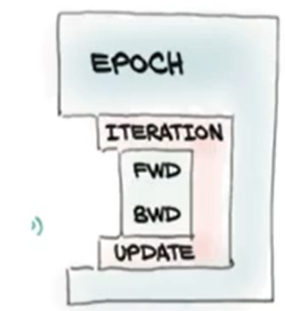
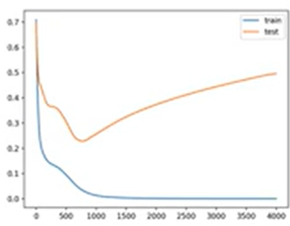
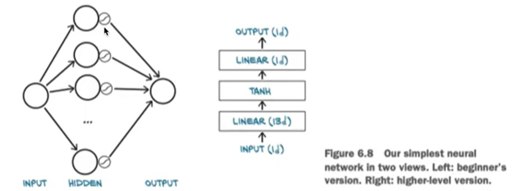
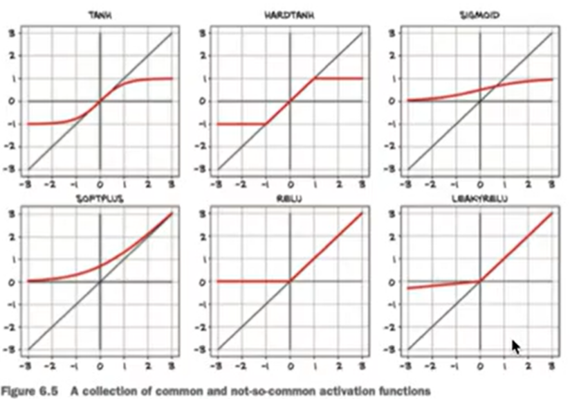
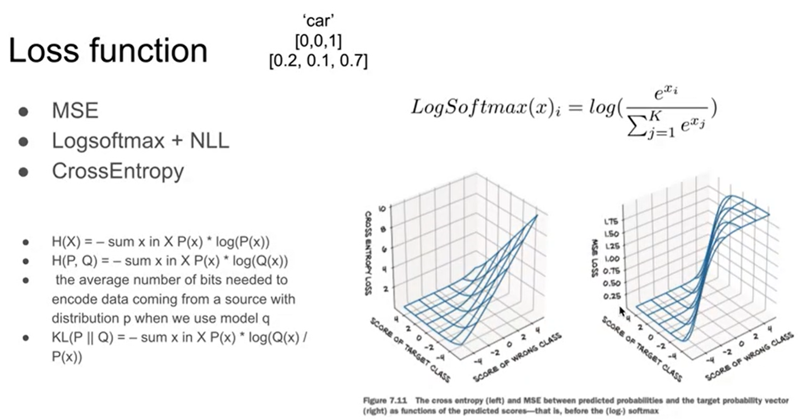
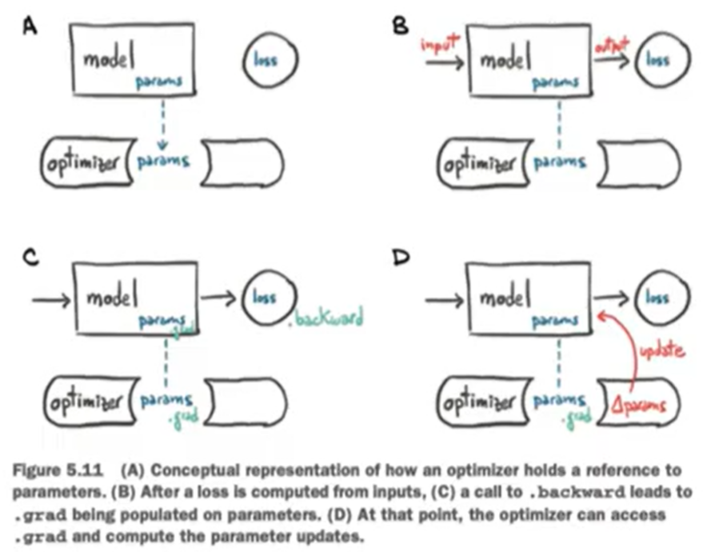

## 파이토치 : 뉴럴 네트워크

### Code structure

​											

> x축 epoch, y축 loss (test-overfitting됨)

For each iteration, we will:

- Select a mini-batch of data (of size bs)
- Forward pass:
  - use the model to make predictions
  - calculate the **loss** - loss 손실 계산
- Backward pass : `loss.backword()` updates the gradients of the model, - loss에 따른 각 weight들의 기여도를 계산(gradient로)
- Weigth update : Have the **optimizer** take a step in toward lower loss
- Zero any old gradients - 이미 써버린 gradient 비움.


### Torch.nn - layer, activation function, loss function



* Layer

  * Linear
  * Convolutional
  * Recurrent

* Activation function

  

  > sigmoid, RELU 많이 사용

* Loss function 손실 함수

  

  > car => [0, 0, 1]  /  [0.2, 0.1, 0.7] => car일 확률이 0.7, ~일 확률이 0.2, ...


### Let's build our model! 조립하기

* Use nn.Sequential
* Subclass nn.Module
  * a container for state in the forms of Parameters and submodules combined with the instructions to do a forward.


### torch.optim (Optimizer)



* SGD
* Adam
* RMSprops
* Adagrad
* Adadelta

### Dataset/data_loader

* Structure : (Data, Groundtruth)
* Batch (N * ...)
  * Tabular (N, C)
  * 2D image (N, C, H, W)
  * 3D image (N, C, D, H, W)
  * Time-series data (N, C, L)
* Data split :
  * Training
  * Validation
  * Testing


## Torch.nn 튜토리얼

* MNIST data setup (50000, 784) -> 5만개의 training data, 28*28 image

```python
from pathlib import Path
import requests

DATA_PATH = Path("data")
PATH = DATA_PATH / "mnist"
PATH.mkdir(parents=True, exist_ok=True)

URL = "https://github.com/pytorch/tutorials/raw/master/_static/"
FILENAME = "mnist.pkl.gz"

if not (PATH / FILENAME).exists():
    content = requests.get(URL + FILENAME).content
    (PATH / FILENAME).open("wb").write(content)
    
import pickle
import gzip
with gzip.open((PATH / FILENAME).ax_posix(), "rb") as f:
    ((x_train, y_train), (x_valid, y_valid), _) = pickle.load(f, encoding="latin-1")
```

* convert data => tensor로 바꿈

```python
import torch
x_train, y_train, x_valid, y_valid = map(
	torch.tensor, (x_train, y_train, x_valid, y_valid)
)
n, c = x_train.shape
print(x_train.shape, y_train.min(), y_train.max())	
## torch.size([50000,784]), tensor(0), tensor(9)
```

* Neural net from scratch (no torch.nn)

```python
import math

weights = torch.randn(784, 10) / math.sqrt(784)	# 28*28
weigths.requires_grad_()
bias = torch.zeros(10, requires_grad=True)

def log_softmax(x):		# layer
    return x = x.exp().sum(-1).log().unsqueeze(-1)
def model(xb):
    return log_softmax(xb @ weights + bias)

bs = 64		# batch size
xb = x_train[0:bs]		# a mini-batch from x
preds = model(xb)		# predictions
preds.shape				## torch.Size([64, 10]) => dimension 10개

def nll(input, target):		# loss function
    return -input[range(target.shape[0]), target].mean()
loss_func = nll

yb = y_train[0:bs]
print(loss_func(preds, yb))		## tensor(2.4330, grad_fn=<NegBackward>)

def accuracy(out, yb):
    preds = torch.argmax(out, dim=1)
    return (preds == yb).float().mean()
print(accuracy(preds, yb)) 		## tensor(0.0781) => 7% = 100개 중 7개의 데이터만 맞추고 있음
## training 하기 전 상태였음.

# training 한 후 정확도 1로 상승
```


* Using torch.nn.functional

```python
import torch.nn.functional as F
loss_func = F.cross_entropy			## model의 log_softmax 사용한것과 같음
def model(xb):
    return xb @ weights + bias
```

```python
from torch import nn

class Mnist_Logistic(nn.Module):
    def __init__(self):
        super().__init__()
        self.weights = nn.Parameter(torch.randn(784,10) / math.sqrt(784))
        self.bias = nn.Parameter(torch.zeros(10))
        
    def forward(self, xb):
        return xb @ self.weights + self.bias

model = Mnist_Logistic()
print(loss_funtion(model(xb), yb))		## tensor(2.3825, grad_fn=<NllLossBackward>)

## training
def fit():
    for epoch in range(epochs):
        for i in range((n-1)//bs + 1):
            start_i = i + bs
            end_i = start_i + bs
            xb = x_train[start_i:end_i]
            yb = y_train[start_i:end_i]
            pred = model(xb)
            loss = loss_func(pred, yb)
            
            loss.backward()
            with torch.no_grad():
                for p in model.parameters():		# weight, bias들이 parameter에 있음
                    p -= p.grad * lr
                model.zero_grad()
fit()
```


* Refactor using optim

```python
from torch import optim

def get_model():
    model = Mnist_Logistic()
    return model, optim.SGD(model.parameters(), lr=lr)

model, opt = get_model()
print(loss_func(model(xb), yb))		## tensor(2.2840, grad_fn=<NllLossBackward>)

for epoch in range(epochs):
    for i in range((n-1)//bs + 1):
        start_i = i + bs
        end_i = start_i + bs
        xb = x_train[start_i:end_i]
        yb = y_train[start_i:end_i]
        pred = model(xb)
        loss = loss_func(pred, yb)

        loss.backward()
        opt.step()
        opt.zero_grad()
        
print(loss_func(model(xb), yb))		## tensor(0.0808, grad_fn=<NllLossBackward>)   
```


* Refactor using Dataset

```python
from torch.utils.data import TensorDataset
train_ds = TensorDataset(x_train, y_train)

model, opt = get_model()
for epoch in range(epochs):
    for i in range((n-1)//bs + 1):
        xb, yb = train_ds[i*bs: i*bs + bs]
        pred = model(xb)
        loss = loss_func(pred, yb)

        loss.backward()
        opt.step()
        opt.zero_grad()
        
print(loss_func(model(xb), yb))		## tensor(0.0807, grad_fn=<NllLossBackward>)   
```

* Refactor using DataLoader

```python
from torch.utils.data import TensorDataLoader
train_ds = TensorDataset(x_train, y_train)
train_dl = DataLoader(train_ds, batch_size=bs)		# iterator

model, opt = get_model()
for epoch in range(epochs):
    for xb, yb in train_dl:
        pred = model(xb)
        loss = loss_func(pred, yb)

        loss.backward()
        opt.step()
        opt.zero_grad()
        
print(loss_func(model(xb), yb))		## tensor(0.0810, grad_fn=<NllLossBackward>)   
```

