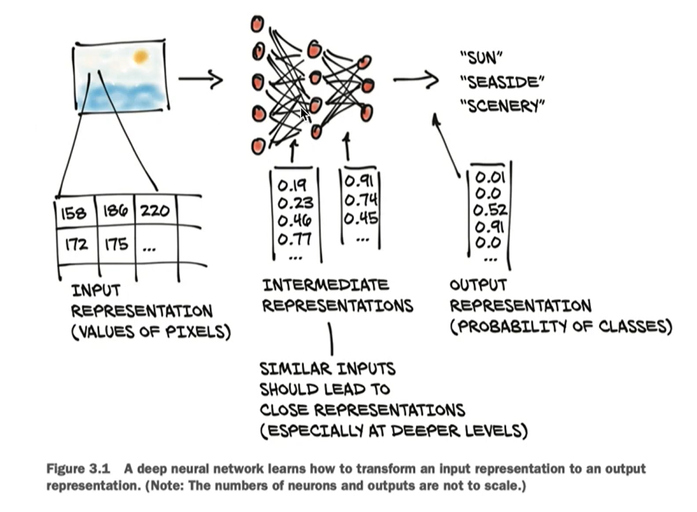
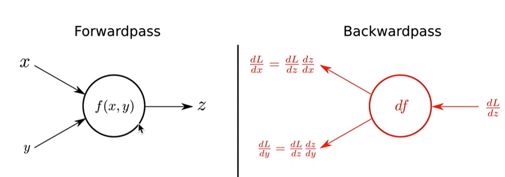
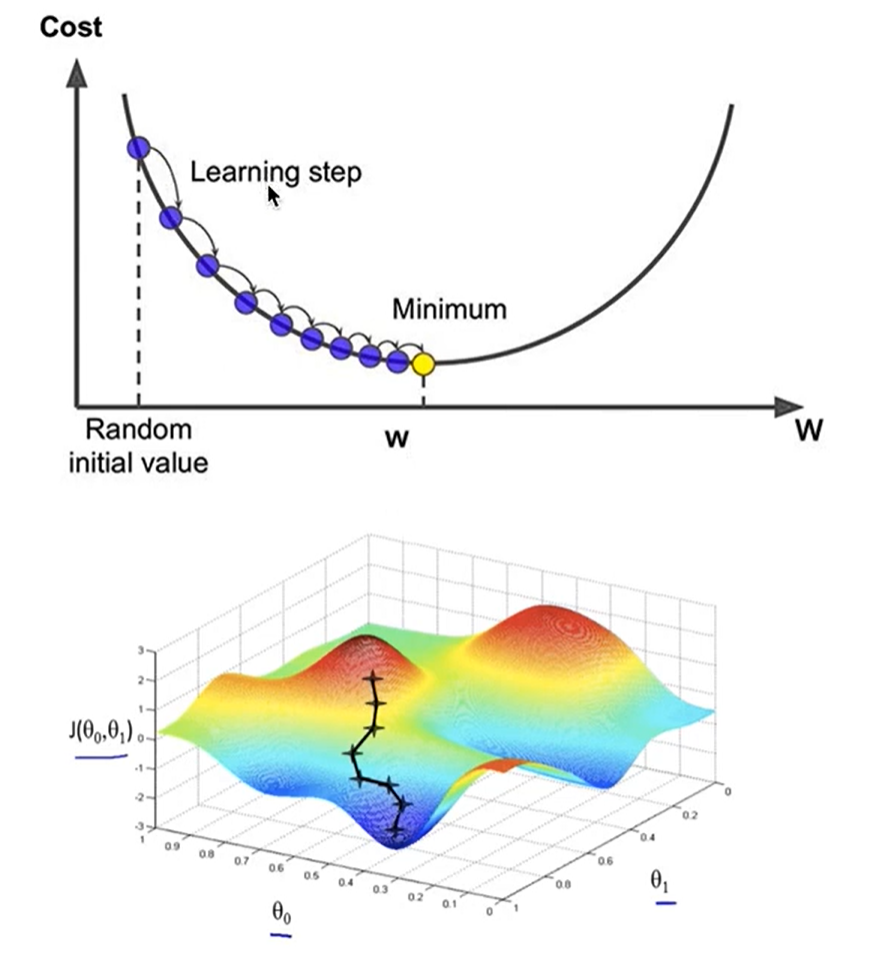
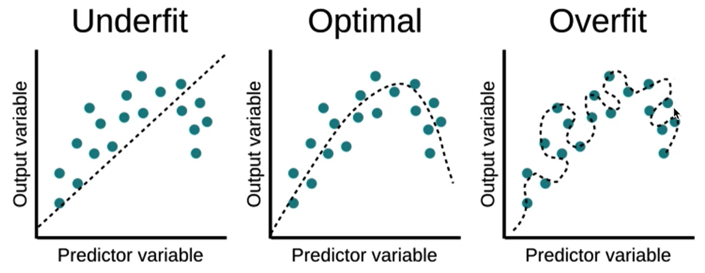

## 딥러닝

### 1. 딥러닝이란

* Deep Learning

* Backpropagation

  

* Gradient Descent

  

### 2. 기존 머신러닝과의 차이점

* 장점 : Feature Learning

  * Image -> Feature Extraction -> Classicifation
  * 하지만 머신러닝은 Feature Extraction 알아서 함. 
  * SIFT, HOG, GIST ... etc

* 단점 : 계산량 

  * 노드수, 레이어 수가 훨씬 많음

  * 해결책 : 좋은 컴퓨터 + GPU computing

* 딥러닝의 단점 : Overfitting

  

  * 해결책 
    * More data, augmentation
    * Regularization
    * Dropout
    * Batch normalization 그룹화 시켜서

### 3. 딥러닝 라이브러리

* Tensorflow, Pytorch, Keras

* 왜 파이토치?
  * 많이 씀 (forum, tutorial 풍부)
  * Tensorflow에 비해 상대적으로 쉬움
  * Keras에 비해 상대적으로 유연/투명함

* Pytorch의 주요 구성
  * Tensor
  * Autograd
  * Torch.nn module
  * Optimizer
  * Data Loader
  * Other APIs (e.g., pretained networks, datasets)

